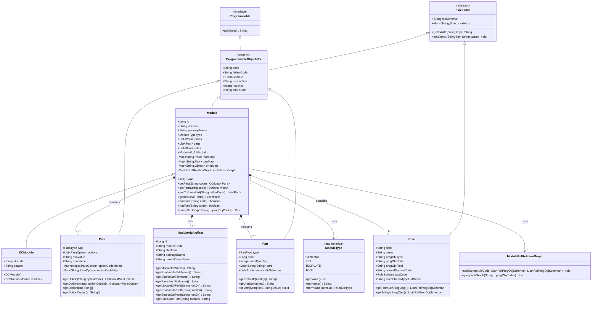

# Module 类组成图

## 类继承关系图

## Module 类关键属性说明

### 核心属性

| 属性名 | 类型 | 说明 |
|--------|------|------|
| `id` | `Long` | 模块唯一标识ID |
| `version` | `String` | 模块版本号，默认值为 "1.0.0" |
| `packageName` | `String` | 模块所属包名 |
| `type` | `ModuleType` | 模块类型（GENERAL/SET/TEMPLATE/TOOL） |

### 组成属性

| 属性名 | 类型 | 说明 |
|--------|------|------|
| `paras` | `List<Para>` | 参数列表，模块中定义的所有参数 |
| `parts` | `List<Part>` | 部件列表，模块中定义的所有部件 |
| `rules` | `List<Rule>` | 规则列表，模块中定义的所有约束规则 |
| `alg` | `ModuleAlgArtifact` | 算法制品描述信息，包含算法相关的元数据 |

### 内部缓存属性（@JsonIgnore）

| 属性名 | 类型 | 说明 |
|--------|------|------|
| `paraMap` | `Map<String, Para>` | 参数编码到参数对象的映射，用于快速查找 |
| `partMap` | `Map<String, Part>` | 部件编码到部件对象的映射，用于快速查找 |
| `errorMap` | `Map<String, Object>` | 错误信息映射 |
| `refRelationGraph` | `ModuleRefRelationGraph` | 模块引用关系图，用于规则依赖分析 |

### 继承自 ProgrammableObject<Integer> 的属性

| 属性名 | 类型 | 说明 |
|--------|------|------|
| `code` | `String` | 模块编码 |
| `fatherCode` | `String` | 父模块编码 |
| `defaultValue` | `Integer` | 默认值（继承自泛型参数） |
| `description` | `String` | 模块描述信息 |
| `sortNo` | `Integer` | 排序号 |
| `shortCode` | `String` | 短编码，仅用于调试 |

### 继承自 Extensible 的属性

| 属性名 | 类型 | 说明 |
|--------|------|------|
| `extSchema` | `String` | 扩展属性schema |
| `extAttrs` | `Map<String, String>` | 扩展属性映射 |

## DCModule 子类关键属性

| 属性名 | 类型 | 说明 |
|--------|------|------|
| `dccode` | `String` | DC公司特有的模块编码 |
| `season` | `String` | 季节属性，扩展字段 |

## 关键方法说明

### Module 类核心方法

1. **`init()`** - 初始化方法，建立映射关系提升效率
   - 初始化 `paraMap` 和 `partMap`
   - 初始化短编码
   - 初始化引用关系图

2. **`getPara(String code)`** - 根据编码获取参数对象
   - 返回 `Optional<Para>`，不存在时返回 `Optional.empty()`

3. **`getPart(String code)`** - 根据编码获取部件对象
   - 返回 `Optional<Part>`，不存在时返回 `Optional.empty()`

4. **`getChildrenPart(String fatherCode)`** - 根据父部件编码获取子部件列表

5. **`getTopLevelParts()`** - 获取所有顶级部件（没有父部件的部件）

6. **`hasPara(String code)`** - 检查是否包含指定编码的参数

7. **`hasPart(String code)`** - 检查是否包含指定编码的部件

8. **`querySubGraph(String... progObjCodes)`** - 查询子图
   - 返回 `Pair<List<String>, List<RefProgObjSchema>>`
   - 包含依赖的 ruleCode 列表和依赖的 RefProgObjSchema 列表

## ModuleType 枚举值

| 枚举值 | 数值 | 名称 | 说明 |
|--------|------|------|------|
| `GENERAL` | 1 | "General" | 通用模块 |
| `SET` | 4 | "SET" | 集合模块 |
| `TEMPLATE` | 8 | "Template" | 模板模块 |
| `TOOL` | 16 | "Tool" | 工具模块 |

## 类关系说明

1. **Module 继承关系**：
   - `Module` → `ProgrammableObject<Integer>` → `Extensible`
   - `Module` 实现 `Programmable` 接口（通过父类）

2. **Module 组合关系**：
   - Module 包含多个 `Para`（参数）
   - Module 包含多个 `Part`（部件）
   - Module 包含多个 `Rule`（规则）
   - Module 包含一个 `ModuleAlgArtifact`（算法制品）

3. **Module 关联关系**：
   - Module 使用 `ModuleType` 枚举标识类型
   - Module 使用 `ModuleRefRelationGraph` 管理引用关系

4. **子类扩展**：
   - `DCModule` 继承 `Module`，添加了 DC 公司特有的字段

