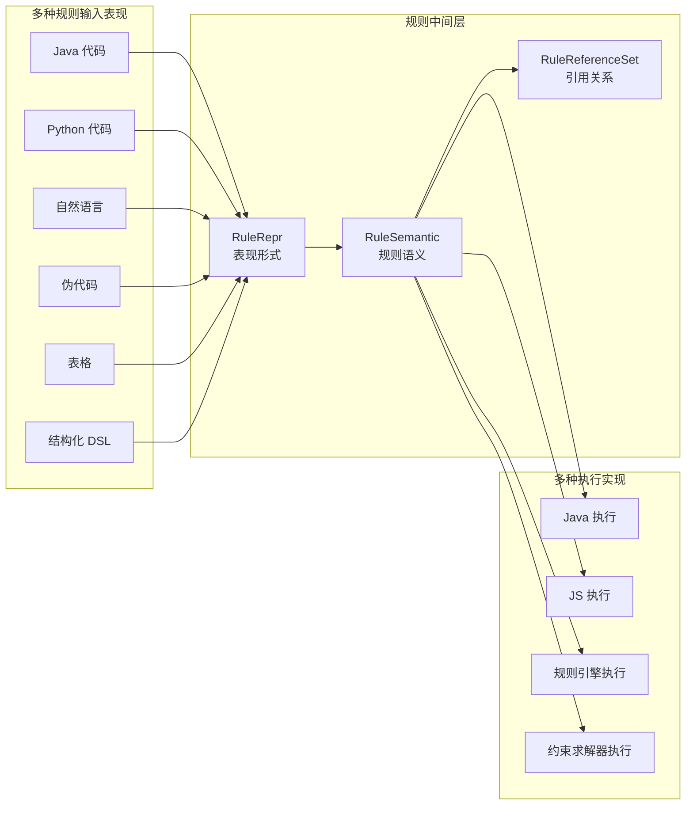
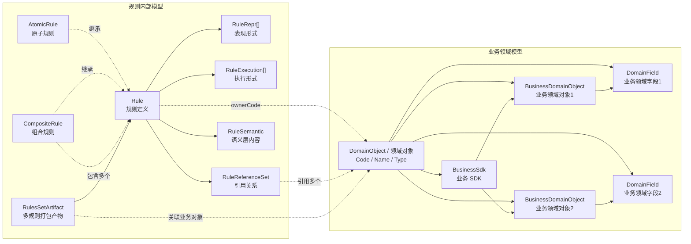
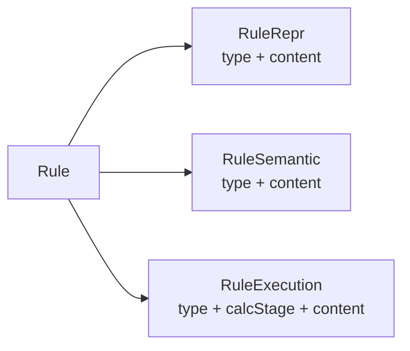
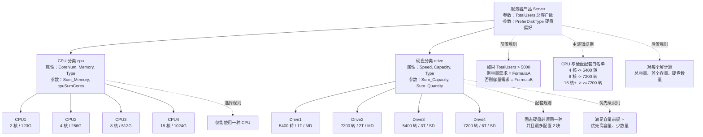

# RFC-0008: 规则模型 IR 重构与三段式执行示意

> 状态：草案（Draft）
> 日期：2026-05-19
> 相关文档：`doc/CORE-DESIGN.md`, `doc/ACCEPTANCE.md`, `doc/RFC-0004-Hybrid-Calculation-Pre-Mid-Post.md`, `doc/RFC-0005-0.1-North-South-Interface-Decoupling-Patch.md`, `doc/RFC-0007-Struct-Combination-Rule-Schema.md`, `doc/RFC-0009-Optional-PartCategory-Whitelist-Guard.md`

---

## 设计决策摘要

本 RFC 是规则模型重构总纲。`RFC-0007` 已经细化了结构化组合规则，本 RFC 在更高一层定义规则的中间表示、表现形式、执行形式、业务领域对象、业务 SDK、领域对象引用和业务讲解图。

| 主题 | 决策 |
| --- | --- |
| 核心理念 | 采用“一语多表多实现”：同一规则语义可以有多个表现形式和多个执行形式 |
| 编译器参考 | 借鉴 LLVM、MLIR、GCC、LSP 的分层思想：输入形式与执行目标之间放稳定中间层 |
| 当前代码基线 | 当前 `Rule` 仍是单一模型，已有 `progObjType/progObjCode/progObjField`、`rawCode`、`ruleSchemaTypeFullName`、`fatherCode`、`calcStage`；尚无 `ownerCode`、`AtomicRule`、`CompositeRule`、`RuleRepr`、`RuleExecution`、`RuleReferenceSet` |
| 领域对象 | 目标模型使用 `DomainObject` 作为统一抽象；业务领域对象、领域字段、业务 SDK 都属于领域对象 |
| 规则归属 | 目标模型中每条 `Rule` 通过 `ownerCode` 归属于一个领域对象；当前代码还未提供该字段 |
| 规则引用 | 目标模型中每条 `Rule` 可以引用多个其他领域对象及字段；当前可复用 `RefProgObjSchema` 作为对象字段引用基础 |
| 规则类型 | 目标模型将 `Rule` 分为 `AtomicRule` 和 `CompositeRule`；当前代码还没有这两个子类型 |
| 规则结构 | 目标模型中 `Rule` 由 `RuleRepr[]`、`RuleSemantic`、`RuleExecution[]`、`RuleReferenceSet` 四部分组成 |
| 命名调整 | 使用 `RuleRepr` 表达规则表现形式，使用 `RuleExecution` 表达规则执行形式 |
| 打包产物 | 目标模型使用 `RulesSetArtifact` 表示多条规则打包后的产物，例如 JAR 包 |
| 执行流程 | 当前公开南向入口是 `ModuleAlgBase`，CP 建模通过 `ModuleCPModel` / `AlgCP*` facade；OR-Tools 只作为引擎内部实现细节出现 |

---

## 1. 摘要

当前规则模型需要从“能执行规则”进一步抽象为“能表达、编辑、分析、调度和执行规则”。业务侧希望规则模型像编译器一样：多种输入形式先进入稳定的规则中间层，再生成不同执行形式。

本 RFC 提议以 `DomainObject` 作为业务领域统一抽象，以 `Rule` 为规则定义入口。每条规则通过 `ownerCode` 归属于一个领域对象，可以引用多个领域对象，并通过 `RuleRepr`、`RuleSemantic`、`RuleExecution` 和 `RuleReferenceSet` 分离表现、语义、执行和依赖关系。

本文已按 `RFC-0005-0.1` 后的南向接口重构刷新：`DomainObject`、`AtomicRule`、`CompositeRule`、`RuleRepr`、`RuleExecution`、`RuleReferenceSet`、`RulesSetArtifact` 都是目标 IR 模型，不是当前代码中已经存在的类。当前可落地基线是 `Rule.rawCode` / `RuleSchema` / `RefProgObjSchema` / `CalcStage`，以及 `ModuleAlgBase`、`ModuleCPModel`、`ModuleInstView` 这组南向 facade。

---

## 2. 动机

### 2.1 问题背景

规则的业务语义往往只有一个。例如：

```text
如果颜色是红色，那么 CPU 数量等于 1。
```

但它可以有多种表现方式：

```java
if (Color.Value == "Red") {
    CPU.Quantity = 1;
}
```

```python
if Color.Value == "Red":
    CPU.Quantity = 1
```

```text
自然语言：如果颜色是红色，那么 CPU 数量等于 1。
伪代码：IF Color.Value == Red THEN CPU.Quantity = 1
表格：条件列 Color.Value = Red，结果列 CPU.Quantity = 1
```

执行时也可能有多种实现：

- Java 代码执行。
- JS 代码执行。
- 规则引擎执行。
- 约束求解器执行。

如果没有中间层，表现形式会直接绑定执行实现，后续编辑器、维护态管理、差量调度、影响分析都会变复杂。

### 2.2 编译器和语言服务器参考模型

本 RFC 参考以下模型：

- LLVM 使用稳定的 LLVM instruction set 作为在线和离线代码表示，同时支持多个前端、优化 pass 和可重定向的代码生成器。
- LLVM backend 的职责是把 LLVM IR 转换为指定机器或其他语言的代码。
- MLIR 强调 Multi-Level IR，允许从高层数据流图逐步 lowering 到目标相关代码。
- GCC 使用 GENERIC、GIMPLE、RTL 等多层中间表示，其中 GENERIC/GIMPLE 是语言无关表示，RTL 更接近后端。
- LSP 把语言能力放在 Language Server 中，用标准协议连接开发工具，使一个语言服务可以被多个工具复用；同时 LSP 的协议层避免暴露复杂 AST 和编译器符号。

对规则模型的启发：

```text
多种规则输入形式       -> RuleRepr
稳定业务语义中间层     -> RuleSemantic
依赖/影响分析          -> RuleReferenceSet
多种执行后端           -> RuleExecution
多条规则打包部署       -> RulesSetArtifact
```

因此，规则模型不应该把自然语言、表格、Java 方法、约束求解模型混在一个字段里，而应该明确分层。

### 2.3 当前代码基线与启发

现有代码已经提供了若干基础，但它们仍是重构前后的过渡模型，不能直接等同于本 RFC 的目标 IR：

- `Rule` 已经有 `code`、`name`、`normalNaturalCode`、`rawCode`、`fatherCode`、`calcStage` 等字段。
- `Rule` 当前还保留 `progObjType`、`progObjCode`、`progObjField`，用于表达规则挂载或引用的可编程对象；尚未新增 `ownerCode`。
- `RuleSchema` 已有 `CompatiableRuleSchema`、`CalculateRuleSchema`、`SelectRuleSchema`、`PriorityRuleSchema`、`CodeRuleSchema`。
- `RefProgObjSchema` 已表达 `progObjType`、`progObjCode`、`progObjField`。
- `CalcStage` 已定义 `PRE`、`MID`、`POST`。
- `ModuleConstraintExecutor` 当前提供 `init/fini/addModule/removeModule/inferParas/postCalculate`，尚未提供 `validate(ModuleValidateReq)`。
- `ModuleAlgBase` 是当前产品算法基类，运行时提供 `model()`、`currentInst()`、`partVars()` 和兼容规则辅助方法。
- `ModuleCPModel`、`PartCategoryCPModel`、`com.jmix.executor.southinf.cp.*`、`com.jmix.executor.southinf.var.*` 是当前稳定南向 facade；产品算法不直接依赖 `com.jmix.executor.impl.*` 或 `com.google.ortools.*`。
- `PostCalcRuleTest` 已验证 `POST` 规则可以通过 `ModuleInstView` / `PartCategoryInstView` 对每个解写入后置参数。
- `MultiPCTest` 已体现 CPU、drive、输入参数、兼容规则、优先级规则和约束求解的组合场景。

这些代码不作为新模型的历史包袱，只作为目标 IR 的概念来源、迁移基线和测试素材。本 RFC 里的 `DomainObject`、`RuleRepr`、`RuleExecution`、`RuleReferenceSet` 等命名均表示目标设计；实现时需要显式新增或映射，不能假设当前代码已经存在。

---

## 3. 设计方案

### 3.1 核心思路：一语多表多实现



“一语多表多实现”含义如下：

- 一语：规则的抽象业务语义，例如 `if Scanner.Value == 1 then CPU.Quantity == 1`。
- 多表：同一语义可以用代码、自然语言、伪代码、表格、结构化 DSL 等方式表现。
- 多实现：同一语义可以生成 Java、JS、规则引擎、约束求解器等不同执行形式。

### 3.2 规则模型总览

模型分为左右两部分：

- 左半部分是业务领域：`DomainObject`、业务领域对象、领域字段、业务 SDK。
- 右半部分是规则内部结构：`Rule`、`AtomicRule`、`CompositeRule`、表现形式、执行形式、引用关系、语义层。



说明：

- 当前代码中 `Rule` 本身已有定义，但还没有拆分为 `AtomicRule` 和 `CompositeRule`；这里描述的是目标模型。
- `CompositeRule` 不是另一套规则对象，它由多个 `Rule` 组成。
- 每条 `Rule` 都归属于一个 `ownerCode` 指向的领域对象。
- 每条 `Rule` 可以引用多个其他领域对象及其字段。
- `RulesSetArtifact` 是多条规则的打包结果，例如一个 JAR、一个 JS bundle、一个规则引擎包或一个求解器模型包。

### 3.3 领域对象模型

领域对象是领域模型的统一抽象。业务领域对象、业务字段和业务 SDK 都属于领域对象。

```java
public abstract class DomainObject {
    private String code;
    private String name;
    private DomainObjectType type;
}

public class BusinessDomainObject extends DomainObject {
    private List<DomainField> fields;
}

public class DomainField extends DomainObject {
    private String dataType;
    private boolean readable;
    private boolean writable;
    private boolean schedulable;
}

public class BusinessSdk extends DomainObject {
    private List<String> domainObjectCodes;
    private List<String> exportedMethods;
}

public enum DomainObjectType {
    BUSINESS_DOMAIN_OBJECT,
    DOMAIN_FIELD,
    BUSINESS_SDK
}
```

产品配置领域示例：

| 类型 | Code | 说明 |
| --- | --- | --- |
| BusinessDomainObject | `Server` | 服务器产品 |
| BusinessDomainObject | `cpu` | CPU 分类 |
| DomainField | `cpu.CoreNum` | CPU 核数 |
| DomainField | `cpu.Quantity` | CPU 数量 |
| BusinessDomainObject | `drive` | 硬盘分类 |
| DomainField | `drive.Speed` | 硬盘转速 |
| DomainField | `drive.Capacity` | 硬盘容量 |
| BusinessSdk | `ServerConfigSdk` | 面向服务器配置领域暴露的业务 SDK |

合同管理领域示例：

| 类型 | Code | 说明 |
| --- | --- | --- |
| BusinessDomainObject | `Contract` | 合同对象 |
| DomainField | `Contract.Customer_Code` | 客户编码 |
| DomainField | `Contract.Price` | 合同价格 |
| BusinessSdk | `ContractRuleSdk` | 面向合同规则暴露的业务 SDK |

规则表达统一基于 `Code.Field`：

```text
Scanner.Value == 1
cpu.Quantity == n
Contract.Customer_Code == "Haier" then Contract.Price <= 5000
```

### 3.4 Rule 的归属和引用

业务对象和领域对象的关系通过两条线表达：

1. 当前代码中，`Rule.progObjType/progObjCode/progObjField` 和 `Rule.fatherCode` 承担了部分挂载语义，其中 `fatherCode` 已用于表示规则挂载的 PartCategory。
2. 目标模型中，每条 `Rule` 都通过 `ownerCode` 归属于某一个领域对象。
3. 目标模型中，每条 `Rule` 可能引用很多其他领域对象。

不再单独定义 `BusinessObjectRef`。规则归属直接使用 `ownerCode`。

```java
public abstract class Rule {
    private String code;
    private String name;
    private String ownerCode;
    private List<RuleRepr> reprs;
    private List<RuleExecution> executions;
    private RuleReferenceSet references;
    private RuleSemantic semantic;
}

public class AtomicRule extends Rule {
}

public class CompositeRule extends Rule {
    private List<Rule> children;
    private CompositeRuleType compositeType;
}
```

迁移约定：

- `ownerCode` 是目标字段，当前 `Rule` 类尚未包含；实现时需要新增字段或提供兼容映射。
- `fatherCode` 不应复用为 `ownerCode`，因为当前代码里它已经表示规则挂载到哪个 `PartCategory`。
- `AtomicRule` / `CompositeRule` 是目标抽象，首期也可以先在单一 `Rule` 上增加 `ruleKind`、`parentRuleCode` 或组合 schema 来过渡，避免一次性破坏序列化兼容。

命名说明：本文使用 `AtomicRule` 表示原子规则。若产品界面希望展示为 “Automatic Rule”，可以作为 UI 文案处理；模型命名建议保留 `Atomic`，避免与“自动执行规则”混淆。

### 3.5 Rule 的三个公共结构

`RuleRepr`、`RuleSemantic`、`RuleExecution` 都是规则的公共组成部分。它们的共性很简单：本质上都是一段带类型的内容，区别只在于这段内容扮演的角色不同。



可以把三者理解为：

- `RuleRepr`：给人看、给编辑器看、给录入界面看的表达。
- `RuleSemantic`：规则真正想表达的业务语义，对我们当前规则来说可以直接是一段语义代码 `content`。
- `RuleExecution`：最终交给 Java、规则引擎、求解器去执行的内容。

统一抽象如下：

```java
public abstract class RuleFacet {
    private String type;
    private String content;
}

public class RuleRepr extends RuleFacet {
}

public class RuleSemantic extends RuleFacet {
}

public class RuleExecution extends RuleFacet {
    private CalcStage calcStage;
}
```

例如：

```text
RuleRepr.content      = "如果颜色是红色，那么 CPU 数量等于 1。"
RuleSemantic.content  = "if (Color.Value == \"Red\") { CPU.Quantity = 1; }"
RuleExecution.content = "model().addEquality(cpuQty, 1).onlyEnforceIf(colorIsRed)"
```

这里 `RuleSemantic` 不再展开成复杂语法树。对我们当前规则模型来说，语义层就是一段语义代码内容；它可以是 Kotlin、结构化 DSL、组合规则 schema 或其他语义表达载体。

### 3.6 RuleRepr：表现形式

`RuleRepr` 是广义“表现形式”，包括人可读表现、结构化表现，也可以包括语义层和执行层的文本化表示。

```java
public class RuleRepr {
    private RuleReprType type;
    private String content;
}

public enum RuleReprType {
    NATURAL_LANGUAGE,
    PSEUDO_CODE,
    TABLE,
    JAVA_CODE,
    PYTHON_CODE,
    JS_CODE,
    STRUCT_DSL,
    SEMANTIC_IR,
    EXECUTION_FORM
}
```

删掉以下字段：

- `language`：与 `type` 重复。
- `normalized`：含义不够稳定。
- `parserName`：属于解析器实现配置，不进入核心模型。
- `checksum`：属于工程产物或缓存层，不进入规则业务模型。

示例：

```json
{
  "reprs": [
    {
      "type": "NATURAL_LANGUAGE",
      "content": "如果颜色是红色，那么 CPU 数量等于 1。"
    },
    {
      "type": "PSEUDO_CODE",
      "content": "IF Color.Value == Red THEN CPU.Quantity = 1"
    },
    {
      "type": "TABLE",
      "content": "{\"condition\":\"Color.Value=Red\",\"action\":\"CPU.Quantity=1\"}"
    }
  ]
}
```

### 3.7 RuleSemantic：语义层

语义层表达规则真正想表达的业务含义。表现形式可以有很多个，但语义层应该只有一个当前有效版本。对于当前规则模型，语义层不展开内部 AST 结构，直接保留为一段有类型的语义内容。

```java
public class RuleSemantic {
    private RuleSemanticType type;
    private String content;
}

public enum RuleSemanticType {
    KOTLIN,
    STRUCT_DSL,
    COMBINATION_SCHEMA,
    FORMULA
}
```

示例：

```text
type    = KOTLIN
content = if (Scanner.Value == 1) { CPU.Quantity = 1 }
```

组合规则细节仍复用 `RFC-0007` 的设计：

- 白名单：命中至少一条允许组合才通过，未命中默认拒绝。
- 黑名单：命中禁止组合则拒绝，未命中默认通过。
- 完备性检查：维护态可以独立做覆盖报告或保存校验；当前代码和 `RFC-0007` 尚未定义 `CompletenessPolicy` 类。

### 3.8 RuleExecution：执行形式

一条规则可以有多个 `RuleExecution`，例如 Java 执行形式、规则引擎执行形式、约束求解器执行形式。

执行形式是规则 IR 的目标字段，不等同于当前产品算法直接编写的 Java 方法。当前南向算法统一继承 `ModuleAlgBase`，通过 `@AlgorithmApiVersion` 声明 API 版本，并经由 `model()` 获取 `ModuleCPModel` facade。

```java
public class RuleExecution {
    private RuleExecutionType type;
    private CalcStage calcStage;
    private String content;
}

public enum RuleExecutionType {
    JAVA,
    JS,
    RULE_ENGINE,
    CONSTRAINT_SOLVER
}
```

执行阶段约定：

| 阶段 | 主要职责 | 推荐执行形式 |
| --- | --- | --- |
| PRE | 输入转换、控制参数补全、前置派生值计算 | 规则引擎、Java |
| MID | 根据产品主逻辑求多种可行解 | 约束求解器 |
| POST | 对每个解补充参数、辅料和展示字段 | 规则引擎、Java |

当前代码中，PRE/MID/POST 的阶段枚举已经存在于 `CalcStage`。POST 阶段已通过 `ModuleConstraintExecutor.postCalculate(ModulePostCalcReq)` 和 `ModuleAlgBase` 实现了对 `ModuleInstView` 的读写；独立 `validate(ModuleValidateReq)` 仍属于后续目标接口。

### 3.9 RuleReferenceSet：引用关系

引用关系只表达调度和影响分析真正需要的内容：引用了哪些领域对象、哪些领域字段。

不表达 token、字面量、静态片段等细粒度结构，避免过度设计。

```java
public class RuleReferenceSet {
    private List<RefProgObjSchema> refs;
}
```

沿用当前代码里的 `RefProgObjSchema` 抽象：

```java
public class RefProgObjSchema {
    private String progObjType;
    private String progObjCode;
    private String progObjField;
}
```

当前代码里 `Rule.getFromLeftProgObjs()` 和 `Rule.getToRightProgObjs()` 已通过 `RuleSchema` 返回 `RefProgObjSchema` 列表。目标 `RuleReferenceSet` 可以先包装这套引用，再逐步扩展为跨规则调度和影响分析需要的统一引用集合。

示例：

```text
if Scanner.Value == 1 then CPU.Quantity = 1
```

引用集合：

| 领域对象 | 字段 | 说明 |
| --- | --- | --- |
| `Scanner` | `Value` | 条件依赖 |
| `CPU` | `Quantity` | 结果依赖 |

这些引用关系用于：

- 维护态做相关性、联动性和影响性分析。
- 运行态做差量调度和精确调度。
- 增量加载时只加载输入对象影响到的规则子图。

### 3.10 RulesSetArtifact：多规则打包产物

`RulesSetArtifact` 不是单条规则产物，而是多条规则按某种执行形式打包后的部署产物。

```java
public class RulesSetArtifact {
    private String code;
    private String name;
    private String ownerCode;
    private RulesSetArtifactType type;
    private List<String> ruleCodes;
    private String artifactUri;
}

public enum RulesSetArtifactType {
    JAVA_JAR,
    JS_BUNDLE,
    RULE_ENGINE_PACKAGE,
    SOLVER_MODEL_PACKAGE
}
```

示例：

```text
ServerConfigRules.jar
  ownerCode: Server
  rules:
    - server_pre_capacity
    - cpu_drive_combo
    - drive_priority
    - post_drive_capacity
```

约束：

- 一个 `RulesSetArtifact` 必须关联到某一个业务，即某一个 `ownerCode` 指向的领域对象。
- 一个 `RulesSetArtifact` 可以包含多条 `Rule`。
- 一条 `Rule` 可以出现在多个 `RulesSetArtifact` 中，例如同时生成 Java JAR 和规则引擎包。

### 3.11 原子规则与组合规则

```java
public enum CompositeRuleType {
    ALL,
    ANY,
    WHITE_LIST,
    BLACK_LIST,
    SEQUENCE
}
```

原子规则表示单条独立规则。组合规则由多个子规则构成。

CPU 与硬盘白名单示例：

```text
4 核 CPU 配套 5400 转硬盘
8 核 CPU 配套 7200 转硬盘
16 核 CPU 配套大于等于 7200 转的硬盘
```

白名单语义：

- 命中至少一条允许组合才通过。
- 未命中的组合默认拒绝。
- 维护态可以检查规则是否穷举。

黑名单语义：

- 命中禁止组合则拒绝。
- 未命中的组合默认通过。

这部分数据结构和执行展开继续参考 `RFC-0007`。

### 3.12 业务讲解第一页：服务器产品结构和规则

第一页材料面向业务人员，重点说明“规则定义在哪里、对象层次是什么、参数和规则如何挂在对象上”。



与现有测试素材的对应关系：

- `MultiPCTest` 提供 CPU 与 drive 的分类、部件、输入参数、兼容规则和优先级规则示例。
- `PostCalcRuleTest` 提供 POST 后置计算示例，包括 `getSumDynAttr`、`setParaValue`、`getQuantity`。

### 3.13 业务讲解第二页：三段式执行流程

第二页材料说明规则引擎如何执行。这里直接用三列来表达，不再使用交叉连线。

| 执行流程 | 求解原理 | 案例演示 |
| --- | --- | --- |
| 客户输入 | 接收业务输入参数 | 配置一台满足 1000 用户的服务器，硬盘尽量使用 SSD |
| 前置计算 | 规则引擎负责输入转换、参数补全、前置派生值计算 | 用户数先转换为 CPU 和容量需求 |
| 主计算 | 约束求解器执行产品主逻辑，生成多种可行解 | 解 1：CPU1 + Drive1；解 2：CPU2 + Drive2；解 3：CPU3 + Drive4 |
| 解集合 | 求解器返回多个可选方案 | 业务可以从多个可行解里继续筛选 |
| 后置计算 | 规则引擎对每个解补充参数、辅料和展示字段 | 进一步补充总容量、硬盘数量、辅料 Part |
| 最终结果 | 输出完整配置结果 | 返回给销售、配置器或后续系统 |

执行解释：

1. 客户输入进入系统，例如 `TotalUsers=1000`、`PreferDiskType=SSD`。
2. 前置计算使用规则引擎，把业务输入转换成求解参数，例如容量需求、CPU 核数需求。
3. 主计算使用约束求解器，执行产品主逻辑，输出多个可行解。
4. 后置计算对每个解执行补充规则，例如计算总容量、派生参数、辅料部件。

注：当前引擎内部仍可使用 OR-Tools CP-SAT，但 `RFC-0005-0.1` 后的产品算法和验收示例应统一使用 `ModuleAlgBase`、`ModuleCPModel`、`AlgCP*`、`PartVar` 等 facade 口径，不直接暴露 `BoolVar`、`Literal`、`IntVar` 等 OR-Tools 类型。

---

## 4. 验收准则

### 4.1 功能验收用例

建议新增目标模型测试文件：

```text
src/test/java/com/jmix/scenario/ruletest/RuleModelConceptTest.java
src/test/java/com/jmix/scenario/ruletest/RuleReferenceModelTest.java
src/test/java/com/jmix/scenario/ruletest/RulesSetArtifactTest.java
```

说明：以下用例验证的是本 RFC 目标 IR 的模型行为。由于当前代码尚未提供 `DomainObject`、`AtomicRule`、`CompositeRule`、`RuleRepr`、`RuleExecution`、`RuleReferenceSet`、`RulesSetArtifact`，这些测试在实现对应模型前不是当前可执行回归测试。当前已存在、可作为运行态基线的回归测试是 `SouthboundApiDecouplingTest`、`PostCalcRuleTest` 和现有兼容规则测试。

#### AC-001: DomainObject 能表达业务领域对象、领域字段和业务 SDK

目的：验证业务 SDK 也是一种领域对象，并能关联多个业务领域对象。

```java
@Test
public void testDomainObject_BusinessSdkOwnsDomainObjects() {
    BusinessDomainObject server = domainObject("Server");
    BusinessDomainObject cpu = domainObject("cpu", field("CoreNum"), field("Quantity"));
    BusinessDomainObject drive = domainObject("drive", field("Speed"), field("Capacity"));

    BusinessSdk sdk = businessSdk("ServerConfigSdk", server, cpu, drive);

    assertEquals(DomainObjectType.BUSINESS_SDK, sdk.getType());
    assertTrue(sdk.getDomainObjectCodes().contains("cpu"));
    assertTrue(sdk.getDomainObjectCodes().contains("drive"));
}
```

#### AC-002: Rule 必须归属于一个 ownerCode 指向的领域对象

目的：验证规则只需要保存 `ownerCode`。

```java
@Test
public void testRuleOwnerCode_IsDomainObjectCode() {
    Rule rule = atomicRule("server_pre_capacity")
            .ownerCode("Server")
            .repr(RuleReprType.NATURAL_LANGUAGE, "如果客户数大于5000，则使用容量公式A")
            .build();

    assertEquals("Server", rule.getOwnerCode());
}
```

#### AC-003: RuleReferenceSet 只表达领域对象和字段引用

目的：验证引用关系不拆 token，不保存字面量，只保存调度需要的对象字段。

```java
@Test
public void testRuleReferences_OnlyDomainObjectFields() {
    Rule rule = atomicRule("scanner_cpu_rule")
            .ownerCode("Server")
            .reference("Para", "Scanner", "Value")
            .reference("PartCategory", "CPU", "Quantity")
            .repr(RuleReprType.PSEUDO_CODE, "IF Scanner.Value == 1 THEN CPU.Quantity = 1")
            .build();

    RuleReferenceSet refs = rule.getReferences();
    assertEquals(2, refs.getRefs().size());
    assertTrue(refs.contains("Scanner", "Value"));
    assertFalse(refs.contains("1"));
}
```

#### AC-004: CompositeRule 可以由多个 Rule 组成

目的：验证 CPU 与硬盘白名单组合可以作为组合规则表达，并复用 `RFC-0007` 的执行语义。

```java
@Test
public void testCompositeRule_WhiteListChildren() {
    Rule r1 = atomicRule("cpu4_drive5400").build();
    Rule r2 = atomicRule("cpu8_drive7200").build();
    Rule r3 = atomicRule("cpu16_drive7200_plus").build();

    CompositeRule combo = compositeRule("cpu_drive_combo")
            .type(CompositeRuleType.WHITE_LIST)
            .children(r1, r2, r3)
            .build();

    assertEquals(3, combo.getChildren().size());
    assertEquals(CompositeRuleType.WHITE_LIST, combo.getCompositeType());
}
```

#### AC-005: Rule 可以有多个 RuleExecution

目的：验证同一规则可以同时拥有规则引擎和约束求解器执行形式。

```java
@Test
public void testRuleExecutions_MultipleBackends() {
    Rule rule = atomicRule("drive_priority")
            .execution(RuleExecutionType.RULE_ENGINE, CalcStage.PRE, "preCapacity")
            .execution(RuleExecutionType.CONSTRAINT_SOLVER, CalcStage.MID, "solverConstraint")
            .build();

    assertEquals(2, rule.getExecutions().size());
}
```

#### AC-006: RulesSetArtifact 打包多条 Rule 并关联业务对象

目的：验证多规则打包产物不是单条规则产物，且必须关联 `ownerCode`。

```java
@Test
public void testRulesSetArtifact_PackageMultipleRules() {
    RulesSetArtifact artifact = rulesSetArtifact("ServerConfigRules")
            .ownerCode("Server")
            .type(RulesSetArtifactType.JAVA_JAR)
            .rule("server_pre_capacity")
            .rule("cpu_drive_combo")
            .rule("post_drive_capacity")
            .artifactUri("build/libs/ServerConfigRules.jar")
            .build();

    assertEquals("Server", artifact.getOwnerCode());
    assertEquals(3, artifact.getRuleCodes().size());
}
```

### 4.2 边界条件

| 条件 | 输入 | 预期行为 |
| --- | --- | --- |
| 表现形式解析失败 | 自然语言无法解析 | 保留 `RuleRepr`，不生成可执行 `RuleSemantic`，维护态提示人工结构化 |
| 引用字段不存在 | `cpu.UnknownField` | 维护态校验失败，不进入执行 |
| 字面量被误识别为引用 | `"Haier"` 或 `1` | 不进入 `RuleReferenceSet` |
| 同一规则多种表现不一致 | 表格和伪代码含义不同 | 维护态提示冲突，要求选择权威表现重新编译 |
| 执行形式不支持某语义 | 约束求解器不支持复杂脚本 | 维护态阻断或要求选择 Java/规则引擎执行形式 |
| 组合白名单未穷举 | 部分组合缺失 | 运行态按白名单语义默认拒绝未覆盖组合；维护态是否警告或阻断由产品策略决定 |
| PRE 规则写入 MID 所需参数失败 | 派生参数为空 | 主计算前阻断并给出规则 code |
| POST 规则读取空解字段 | 某解未选择 drive | 按空值策略返回空、0 或报错，策略需在规则中声明 |

---

## 5. 实现计划

| 阶段 | 任务 | 优先级 | 状态 |
| --- | --- | --- | --- |
| 0 | 保持当前南向边界：目标 IR 生成的执行代码必须继承 `ModuleAlgBase`，使用 `ModuleCPModel` / `AlgCP*` facade，不导入 `impl` 或 OR-Tools | P0 | 已由 `RFC-0005-0.1` 建立 |
| 1 | 新增 `DomainObject`、`BusinessDomainObject`、`DomainField`、`BusinessSdk` 基础模型 | P0 | 规划中 |
| 2 | 在现有 `Rule` 基础上设计兼容迁移：新增 `ownerCode`，并明确与 `progObjType/progObjCode/progObjField/fatherCode` 的映射关系 | P0 | 规划中 |
| 3 | 新增 `AtomicRule`、`CompositeRule` 或等价的过渡字段/组合 schema | P0 | 规划中 |
| 4 | 新增 `RuleRepr` 表现形式模型 | P0 | 规划中 |
| 5 | 新增 `RuleExecution` 执行形式模型 | P0 | 规划中 |
| 6 | 新增 `RuleReferenceSet`，首期包装和复用 `RefProgObjSchema` 的对象字段引用模型 | P0 | 规划中 |
| 7 | 新增 `RuleSemantic`，先按 `type + content` 方式建模，不展开内部语法树 | P1 | 规划中 |
| 8 | 新增 `RulesSetArtifact`，P0 先支持 `JAVA_JAR` 和 `SOLVER_MODEL_PACKAGE` | P1 | 规划中 |
| 9 | 对接 `RFC-0007` 的结构化组合规则；完备性作为维护态覆盖报告，不在当前引擎模型定义 `CompletenessPolicy` | P1 | 规划中 |
| 10 | 基于 `RuleReferenceSet` 支持差量调度、影响分析和精确执行 | P2 | 规划中 |
| 11 | 输出业务讲解材料，可直接从本 RFC 的 Mermaid 图导出 | P2 | 规划中 |

---

## 6. 风险与设计约束

### 6.1 自然语言不可完全自动解析

风险：自然语言存在歧义，不能直接作为执行语义。

策略：自然语言只作为 `RuleRepr`。可执行语义必须来自结构化 IR、表格、DSL 或人工确认后的解析结果。

### 6.2 多执行形式语义不完全一致

风险：Java、JS、规则引擎、约束求解器对同一规则的执行能力不同。

策略：`RuleExecution` 声明执行形式，编译阶段做能力校验；不支持则阻断或要求换执行形式。

### 6.3 引用关系过度建模

风险：如果把 token、字面量、静态语法节点都纳入引用模型，会增加复杂度但对调度价值不大。

策略：`RuleReferenceSet` 只表达领域对象和字段，细粒度表达保留在解析器内部，不进入核心数据模型。

### 6.4 RulesSetArtifact 粒度过大

风险：如果一个 artifact 打包过多规则，会影响增量部署和调试。

策略：artifact 必须关联 `ownerCode`，并记录 `ruleCodes`。后续可以按 owner、阶段、执行形式拆包。

### 6.5 业务术语与代码术语混用

风险：领域里同时出现 `Driver`、`drive`、`DiskDrive` 等不同叫法，容易影响规则建模和材料表达。

策略：当前统一使用 `drive`；如后续需要业务化命名，再统一切到 `DiskDrive`。

---

## 7. 已确认决策

1. 原子规则模型类名统一为 `AtomicRule`。
2. 目标模型中 `Rule` 只保存 `ownerCode`，不直接持有领域对象实例；当前代码还需新增字段或兼容映射。
3. `BusinessSdk` 首期作为 `DomainObject` 子类进入模型，后续再细化方法调用。
4. `RulesSetArtifact` 在 P0 阶段先支持 `JAVA_JAR` 和 `SOLVER_MODEL_PACKAGE`。
5. 公开南向 API 口径统一使用 `ModuleAlgBase`、`ModuleCPModel`、`AlgCP*` facade；OR-Tools 是内部求解实现，不进入产品算法 API。
6. 领域术语当前统一使用 `drive`；如后续需要业务化命名，可统一切到 `DiskDrive`。
7. 组合白名单的完备性不在引擎模型内定义策略类；维护态默认可先按 `WARN` 产品策略展示覆盖报告。

---

## 8. 参考资料

- `doc/CORE-DESIGN.md`
- `doc/ACCEPTANCE.md`
- `doc/RFC-0004-Hybrid-Calculation-Pre-Mid-Post.md`
- `doc/RFC-0005-0.1-North-South-Interface-Decoupling-Patch.md`
- `doc/RFC-0007-Struct-Combination-Rule-Schema.md`
- `doc/RFC-0009-Optional-PartCategory-Whitelist-Guard.md`
- `src/main/java/com/jmix/executor/bmodel/logic/Rule.java`
- `src/main/java/com/jmix/executor/bmodel/logic/RuleSchema.java`
- `src/main/java/com/jmix/executor/bmodel/logic/RefProgObjSchema.java`
- `src/main/java/com/jmix/executor/bmodel/logic/CalcStage.java`
- `src/main/java/com/jmix/executor/ModuleConstraintExecutor.java`
- `src/main/java/com/jmix/executor/southinf/ModuleAlgBase.java`
- `src/main/java/com/jmix/executor/southinf/ModuleCPModel.java`
- `src/main/java/com/jmix/executor/southinf/PartCategoryCPModel.java`
- `src/main/java/com/jmix/executor/southinf/cp/AlgCPModel.java`
- `src/main/java/com/jmix/executor/southinf/var/PartVar.java`
- `src/main/java/com/jmix/executor/southinf/view/ModuleInstView.java`
- `src/main/java/com/jmix/executor/impl/algmodel/ModuleAlgImpl.java`
- `src/main/java/com/jmix/executor/impl/algmodel/ModuleBaseAlgImpl.java`
- `src/main/java/com/jmix/executor/impl/southbridge/SouthboundLatestBridge.java`
- `src/main/java/com/jmix/executor/impl/southbridge/SouthboundModuleAlgAdapter.java`
- `src/test/java/com/jmix/opti/base/MultiPCTest.java`
- `src/test/java/com/jmix/scenario/ruletest/SouthboundApiDecouplingTest.java`
- `src/test/java/com/jmix/scenario/ruletest/PostCalcRuleTest.java`
- [LLVM Features](https://www.llvm.org/Features.html)
- [LLVM: Writing an LLVM Backend](https://llvm.org/docs/WritingAnLLVMBackend.html)
- [MLIR Rationale](https://mlir.llvm.org/docs/Rationale/Rationale/)
- [GCC Internals: Tree SSA / GIMPLE](https://gcc.gnu.org/onlinedocs/gcc-14.2.0/gccint/Tree-SSA.html)
- [Language Server Protocol Overview](https://microsoft.github.io/language-server-protocol/overviews/lsp/overview/)
