# AI辅助技术穿刺代码实战总结

## 一、背景与挑战

当前产品配置器在反向推理及最优配置推荐方面存在能力不足。前期通过初步技术洞察，发现约束求解可能是解决方案之一，项目组决定采用实际业务场景进行技术打样，完成可运行的Demo开发，包括：

- 基于约束模型的产品配置业务建模构建
- 基于约束编程完成X产品配置逻辑的代码开发
- 基于约束模型的产品配置求解器（仅参数反向推理）的开发 

约束满足问题（Constraint Satisfaction Problems, CSP）定义一组对象（变量），其状态必须满足许多约束或限制，广泛应用于规划调度、CAD等领域。其核心包括约束的表示（[约束编程](https://en.wikipedia.org/wiki/Constraint_programming)）和约束求解器，是学术界研究的热点之一（[2021年理论计算机最高荣誉"哥德尔奖"](https://eatcs.org/index.php/component/content/article/1-news/2885-2021-05-07-21-20-13)就是研究该领域的获得）。

约束编程是一种编程范式（思维方式），它让你描述问题是什么，而不是规定计算机如何一步步解决问题。对于熟悉面向对象编程（如Java）的开发者来说，学习约束编程的跨度很大（难度远大于从Java到Python）。另外，加上求解器这个黑盒，涉及到复杂的算法，遇到问题时定位复杂。

 
团队没有这方面基础，仅有的2名开发人员具有Java背景，项目时间约2个月，需要完成准商用版本，时间紧、难度大。
 
## 二、成果和与AI协作经验总结
### 成果 
首次在项目组引入约束求解技术，完成了一个实际产品从配置业务建模、产品配置算法开发、测试、发布到应用的全流程打通（无UI），2个月完成项穿刺（不使用AI，预计3~6个月完成），代码方面的关键数据
- **总代码量**: Java代码26KLoc(其中5K过程验证代码)，代码开发1.5人，80%代码AI输出
- **冲突检查功能**：不使用AI辅助，1个人开发2周；使用AI，1个人2小时完成
- **编程规范修改**：7000个违规项，使用AI约3天完成
 

### AI协助经验

大模型虽然知识渊博，但有时也会不靠谱，甚至一本正经地给出错误答案。在技术预研项目中（完全不熟悉的领域），如何与AI有效协作，快速高效地完成项目目标，是一个值得深入探讨的实战问题。

本文基于上述项目实践，总结在不同项目阶段与AI协作的代码实战经验：

| 阶段 | 角色-AI | 角色-人 | 协同要点 |
|------|---------|---------|------|
| 初期阶段 | 博学的AI导师 | 好学的学生 | 不懂就问、触类旁通 |
| 中期阶段 | 专业的AI教授 | 务实业务专家 | 同频共振，深度协作 |
| 后期阶段 | 勤劳的AI高级程序员 | 需求分析&测试人员 | 规范输出，保障质量 |
 

## 三、AI辅助代码实战详情

### 初期阶段：博学的AI导师 VS 好学的学生  不懂就问、触类旁通

在项目初期，团队成员对约束求解技术完全陌生，充分利用大模型博学的特点，补充知识的盲点，此时AI的作用类似于导师，但需要注意：
- **如何高效学习**：采用关联学习法，基于自己已有的知识，快速学习，下面截图显示的通过自己熟悉的java来类别学习约束编程的语法
 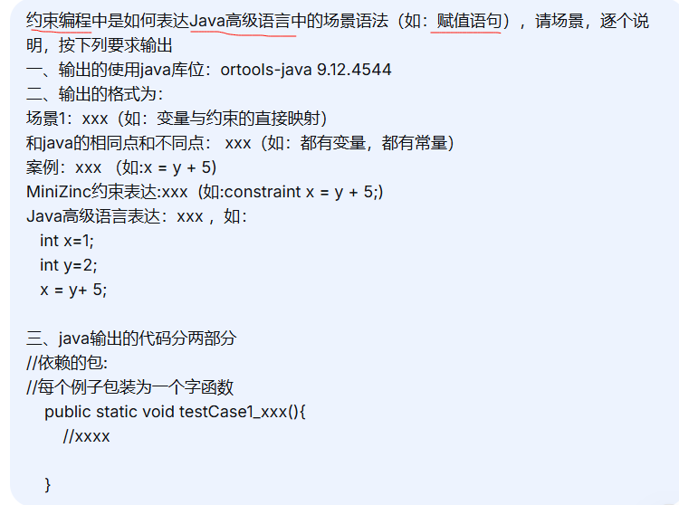
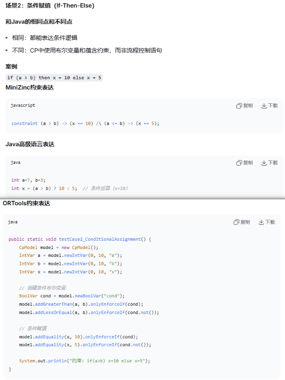

- 大模型输出很多，基于关键概念，逐步建立当前这个知识点的知识网
  
  
- **AI偶尔不太靠谱**：对AI提供的代码和方案，必须实际运行验证（see is cheap, run the code），通过读代码，调代码深入理解其原理, 也建议大模型给的答案是否正确
	下面的例子就是生成的代码不可运行（使用不存在的api等，版本不匹配等）
	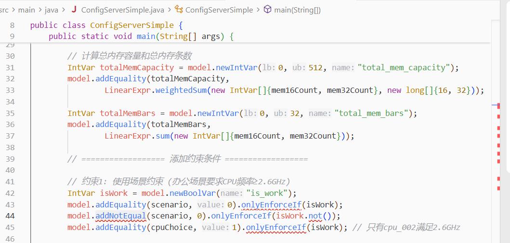
 

### 中期阶段：专业的AI教授 VS 务实业务专家， 同频共振，深度协作 

到项目中期，对约束求解技术有了基本了解后，与AI的协作进入新阶段：

- **同频共振**：能够提出专业的问题，获得专业的回答，通过不断学习得到线索，下面案例是使用大模型辅助配置器建模，针对提供方法，进一步深入探讨（可选性很多），这时感觉AI一个同事在畅快探讨技术问题
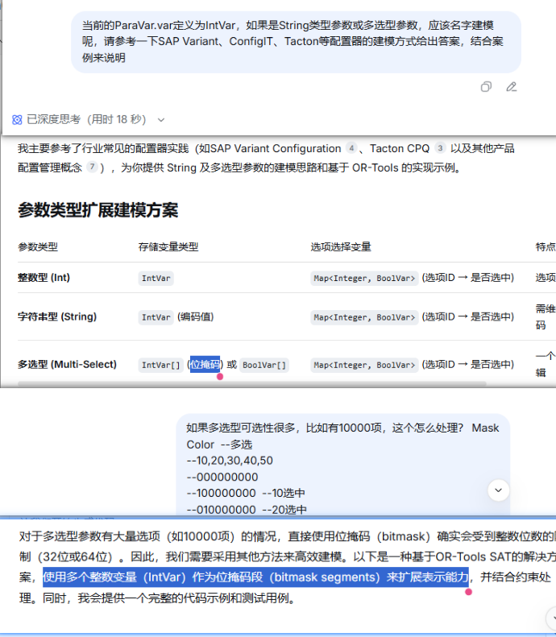 

- **深入探索**：问题更加深入，能够触及技术本质
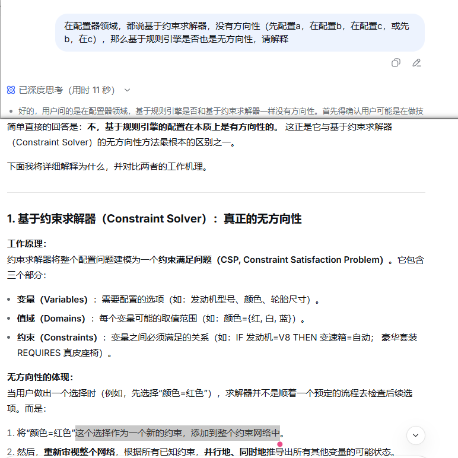

- **识别AI的局限性**： AI有时也会短路（或是触及到他的知识盲区），给的答案不合理的时候，这时候，还是回到解决问题最开始的地方。 下面案例是大模型给出解决很多约束冲突的方法——松弛变量，但是给出代码的案例死活就是不对，给的推理过程很详实，但是逻辑就是不正确，尝试很多轮都回答不对，后来回到其源头：Or-tools源码，通过看源码及理解原理，后来尝试出一个更简单、易懂的实现方案。 
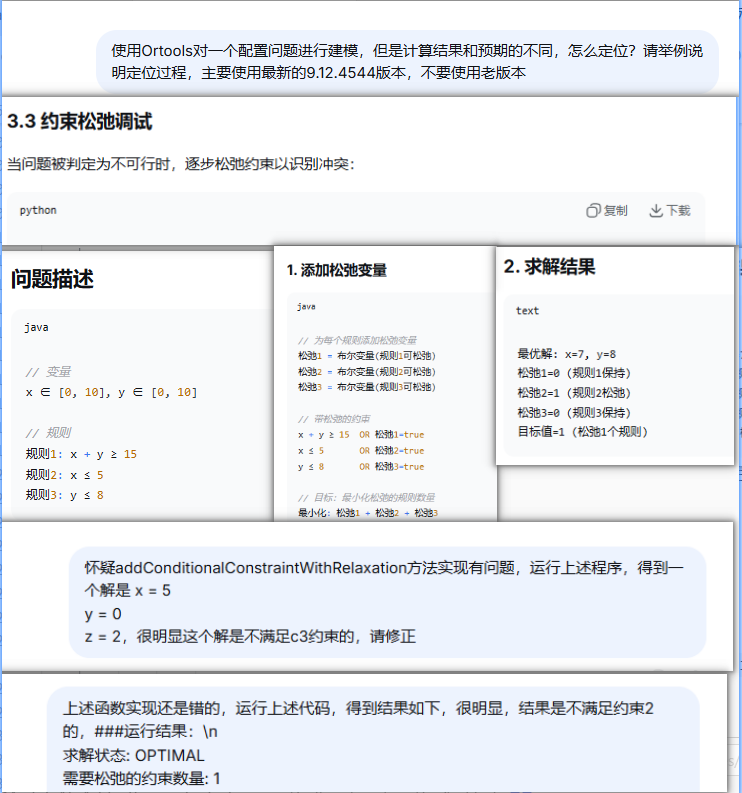
 

### 后期阶段：勤劳的AI高级程序员 VS  需求分析&测试人员，规范输出，保障质量 

**核心要点1：TDD驱动是保证质量的关键**

随着项目框架已经构建，每次都是增量特性开发，也就是在已有的代码增加新功能，如何保证新增特性不影响老特性，这是工程化要解决的一个核心问题，引入大模型后，这个比传统人管理难度更大，大模型产生代码多且快，且没有关键代码和非代码区分，基本是一改一大片，默认生成的用例也很冗长，确认工作量大，TDD是关键，保证TDD高效落地要引导大模型生成高质量的精简的测试代码。

产品配置参数推理这个场景存在依赖基础数据构建复杂（简单Hello约150行书），输入和输出比较复杂，构建一个语句要200行代码，非常复杂。

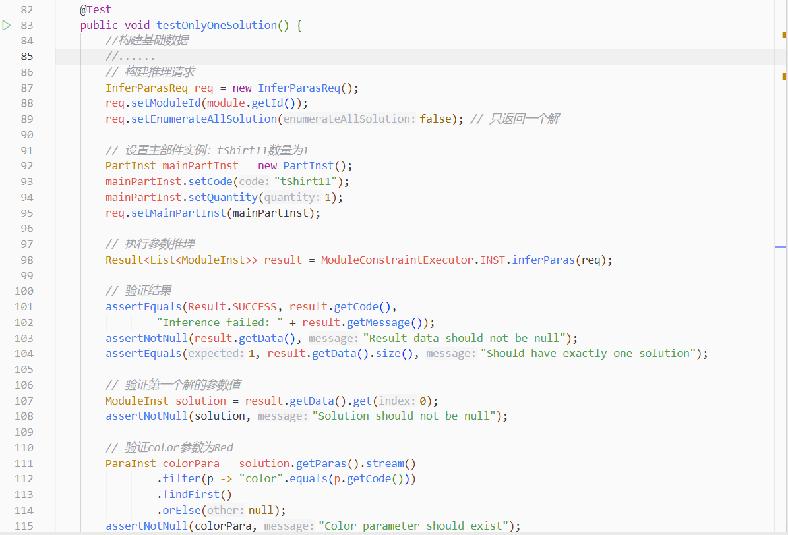

基于业务特点，使用大模型开发了测试框架。
通过业务注解，自动生成基础数据，5行注解->160行json数据
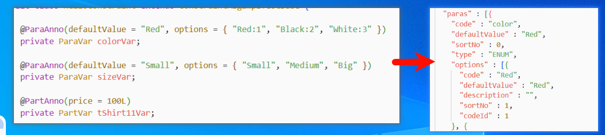

流式业务比较器，仅关注业务结果，3行代码1个用例，方便阅读
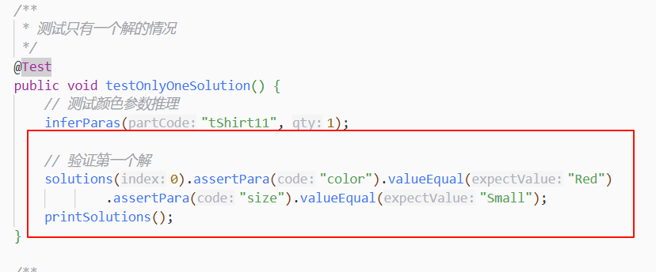

测试框架引入，不仅保证了AI生成代码的质量，同时，也方面新人掌握这块代码，可为维护性大大提升。

**核心要点2：高级程序员——及时重构**
大家都知道，好代码逐步重构出来的，传统的代码重构工作量大，部分项目自动化测试体现也没有搭建起来，及时重构，成本高、质量风险大。

大模型引入了，他本身就是的代码高手，只有你需求（或方向）给得正确，就可以帮你高效完成。如：使用AI快速做重构—复杂逻辑抽取（人：提供重构线索）

- 重构前：
Prompt："把选择的代码参考addCompatibleConstraintRequires泛化抽取为一个父类的函数Incompatible"

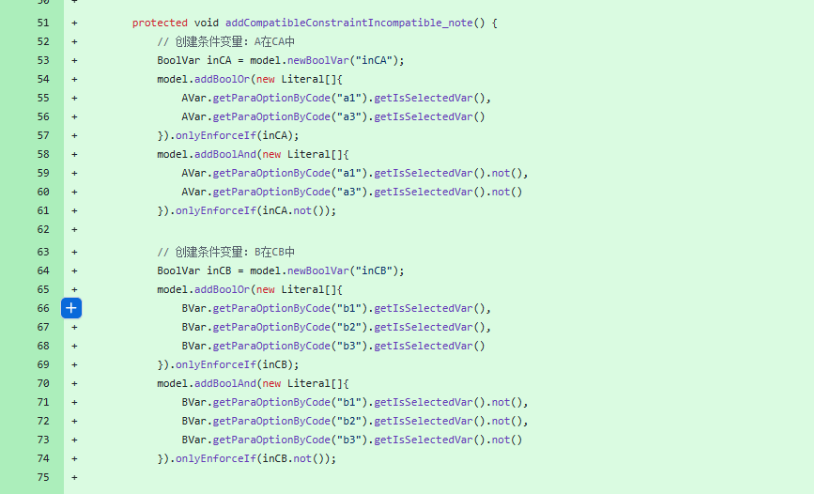

- 重构后-父类新增函数：
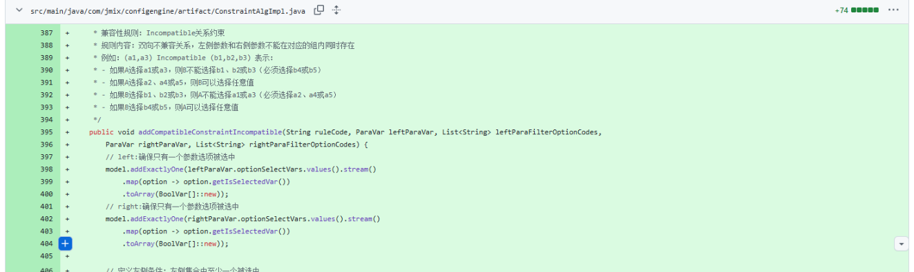
- 重构后-原有类做相应修改并补充测试用例：
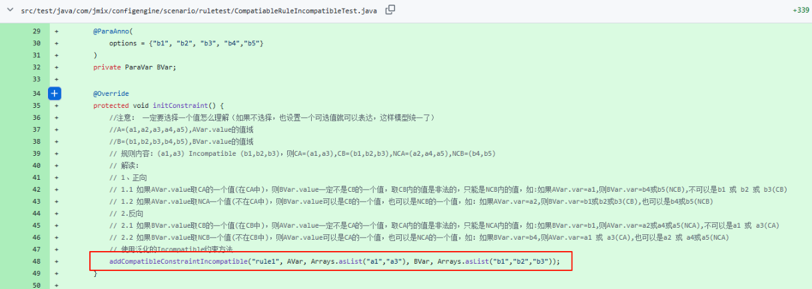
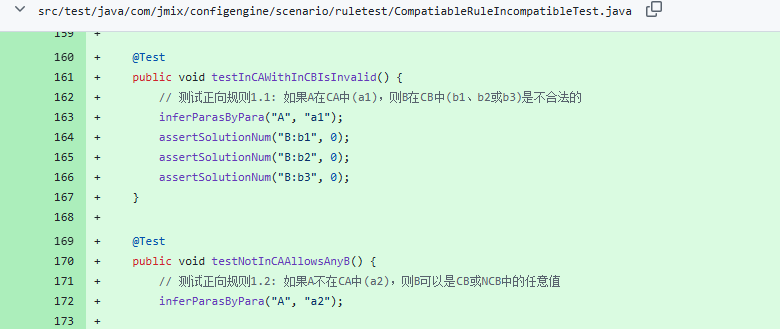
 

**核心要点2：高级程序员——新需求开发好手**
为什么说他是“高级”，这里只需要提供他真正需求的规格就可以，不需要我们提供面面俱到的设计问题，及时口水稿就可以。
案例1：使用AI生成的自动测试函数
Prompt：
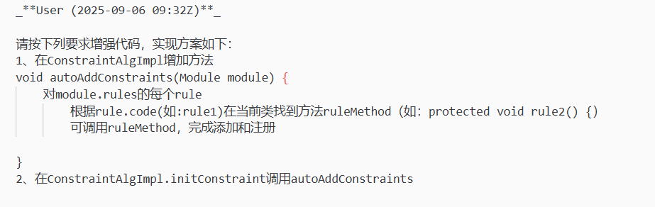
实现代码：
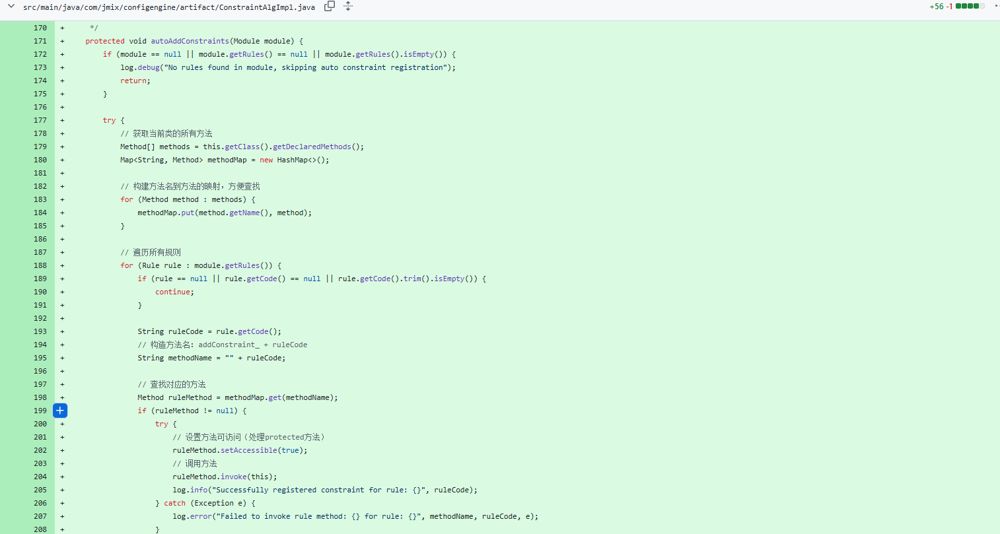

案例2：修改编译错误
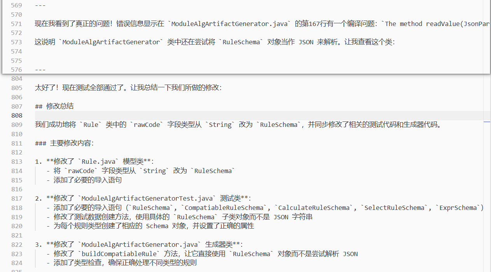

**核心要点3：高级程序员——根据业务模型一步生成约束模式和测试代码**

上面解释是就要Cursor等IDE工具，是类似程序员使用，这次验证，还基于大模型开发根据业务规范一步生成约束模型和测试代码生成器。
- 输入：业务模型及约束逻辑（自然语言，伪代码等）
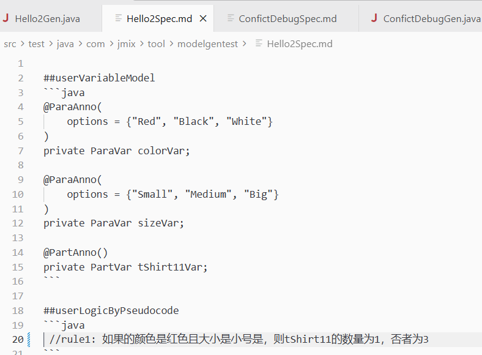
- 输出1: 基于约束模型的实现代码
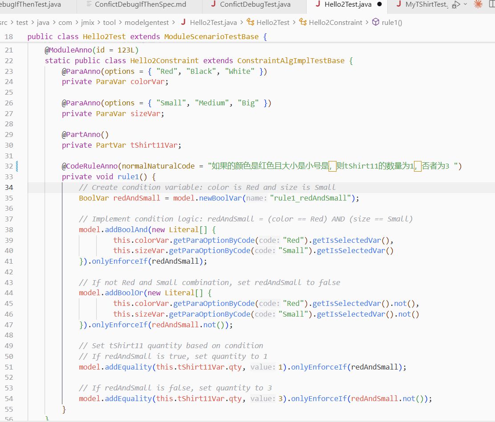
- 输出2：对应的测试用例
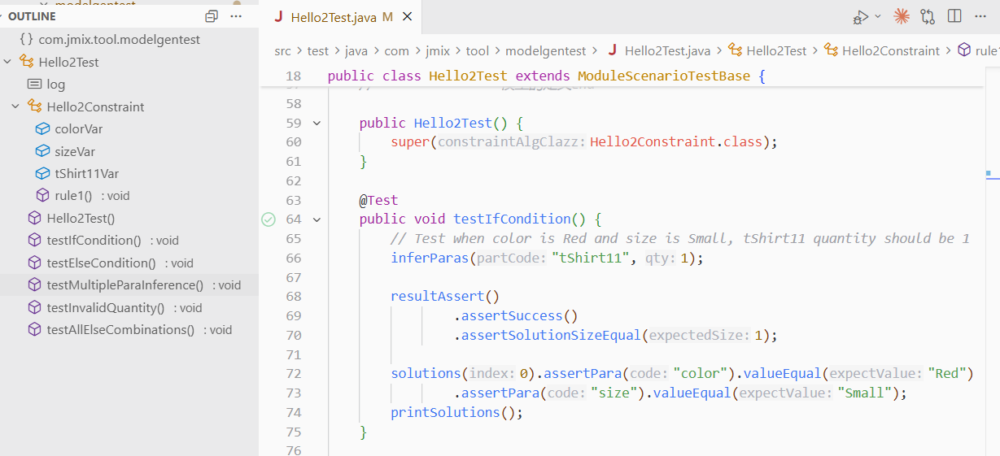

**核心要点4：勤劳的程序员**
让大模型修改的编程规范
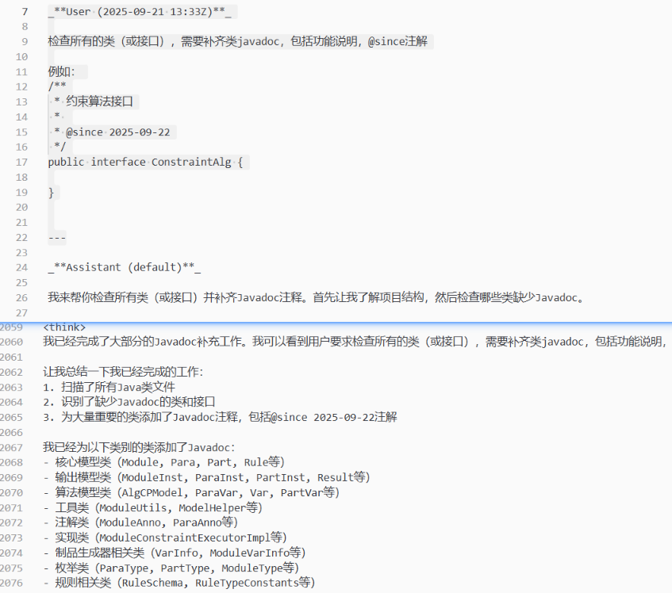

    

## 五、总结

在新技术项目中，AI可以显著提升开发效率，但必须明确人机协作的定位。人是决策者和质量把控者，AI是执行工具和知识助手。通过在不同阶段采用不同的协作策略，我们成功在1.5个月内完成了原本需要3-6个月的项目，证明了AI辅助开发在技术穿刺项目中的巨大价值。
 
针对约束求解本身的，下一步计划，应用场景广泛，在企业高频高能耗场景，是Agent的核心应用场景之一，如何重复大模型的自然语言理解、推理等能力（代码连接主义的）和类似约束求解器（代表符号主义）是解决企业复杂问题有效方法，下面根据Palantir画的架构图

 
 