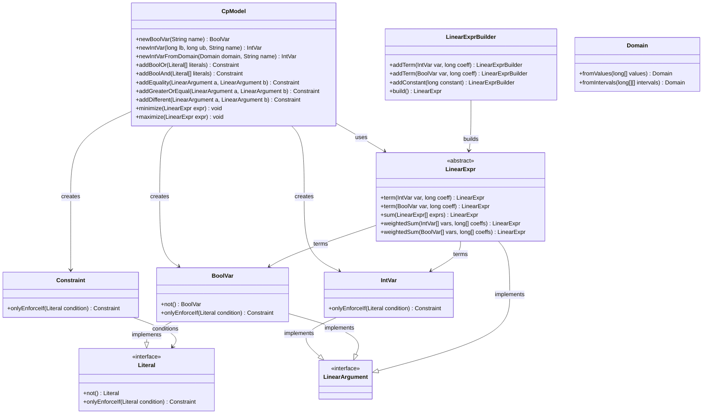

# OR-Tools SAT 包关键类类图

## 概述

本文档分析了 Google OR-Tools SAT (Constraint Programming) 包中的关键类关系，特别是 BoolVar、IntVar、LinearExpr 和 LinearArgument 相关的类层次结构。

基于项目源码分析，以下是这些关键类的类图和关系说明。

## 类图



## 关键类说明

### 1. CpModel 类
- **作用**: 约束编程模型的核心类，负责创建变量和添加约束
- **主要方法**:
  - `newBoolVar(String name)`: 创建布尔变量
  - `newIntVar(long lb, long ub, String name)`: 创建有界整数变量
  - `newIntVarFromDomain(Domain domain, String name)`: 从域创建整数变量
  - `addBoolOr(Literal[])`: 添加或约束
  - `addBoolAnd(Literal[])`: 添加与约束
  - `addEquality()`: 添加等式约束
  - `addGreaterOrEqual()`: 添加大于等于约束
  - `minimize()`/`maximize()`: 设置优化目标

### 2. Literal 接口
- **作用**: 布尔文字的抽象接口
- **主要方法**:
  - `not()`: 返回否定文字
  - `onlyEnforceIf(Literal)`: 条件约束

### 3. BoolVar 类
- **作用**: 布尔变量，表示真/假值
- **特点**: 实现了 Literal 和 LinearArgument 接口
- **使用场景**: 选择状态、条件判断等

### 4. IntVar 类
- **作用**: 整数变量，可以是有界或离散域
- **特点**: 实现了 LinearArgument 接口
- **使用场景**: 数量、值选择等

### 5. LinearArgument 接口
- **作用**: 线性参数的抽象接口，可以参与线性表达式
- **实现类**: IntVar、BoolVar、LinearExpr

### 6. LinearExpr 类
- **作用**: 线性表达式的抽象基类
- **主要静态方法**:
  - `term(var, coeff)`: 创建单项式
  - `sum(exprs)`: 求和
  - `weightedSum(vars, coeffs)`: 加权求和

### 7. LinearExprBuilder 类
- **作用**: 线性表达式构建器，流式API
- **主要方法**:
  - `addTerm(var, coeff)`: 添加项
  - `addConstant(constant)`: 添加常数项
  - `build()`: 构建 LinearExpr

### 8. Constraint 类
- **作用**: 约束对象
- **主要方法**:
  - `onlyEnforceIf(condition)`: 添加条件

### 9. Domain 类
- **作用**: 定义整数变量的取值范围
- **主要方法**:
  - `fromValues()`: 从离散值创建域
  - `fromIntervals()`: 从区间创建域

## 使用模式分析

基于项目源码分析，OR-Tools SAT 的典型使用模式：

### 1. 变量创建模式
```java
// 创建布尔变量
BoolVar boolVar = model.newBoolVar("bool_var");

// 创建整数变量
IntVar intVar = model.newIntVar(0, 100, "int_var");
IntVar domainVar = model.newIntVarFromDomain(Domain.fromValues(new long[]{1,3,5}), "domain_var");
```

### 2. 约束添加模式
```java
// 布尔约束
model.addBoolOr(new Literal[]{var1, var2});
model.addBoolAnd(new Literal[]{var1.not(), var2});

// 算术约束
model.addEquality(var1, var2);
model.addGreaterOrEqual(expr1, expr2);

// 条件约束
constraint.onlyEnforceIf(condition);
```

### 3. 线性表达式构建模式
```java
// 直接方法
LinearExpr expr1 = LinearExpr.sum(new IntVar[]{var1, var2});
LinearExpr expr2 = LinearExpr.term(var1, 2); // 2 * var1

// 构建器模式
LinearExprBuilder builder = LinearExpr.newBuilder();
builder.addTerm(var1, 1).addTerm(var2, 2).addConstant(5);
LinearExpr expr3 = builder.build();
```

## 项目中的实际应用

在 JMix 配置引擎项目中，这些类主要用于：

1. **BoolVar**: 表示部件选择状态、参数隐藏状态等
2. **IntVar**: 表示数量、参数值、属性值等
3. **LinearExpr**: 计算总成本、总容量、总数量等
4. **LinearArgument**: 在约束条件中使用变量和表达式

这样的设计使得约束编程模型能够灵活地表达复杂的业务规则和优化目标。
