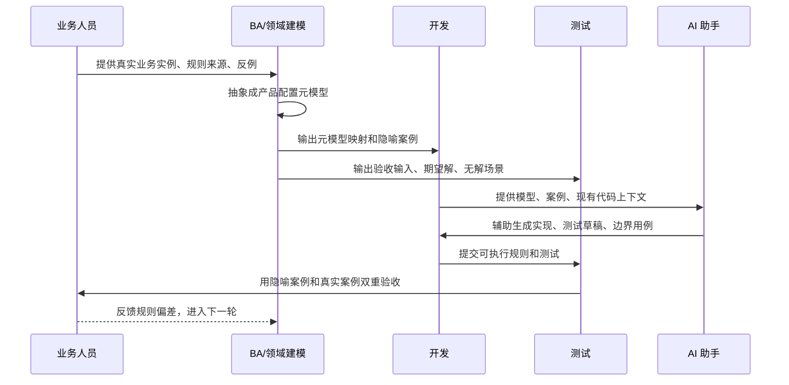

# 复杂配置产品怎么做需求分析：一套“本体实例化”的方法

> 面向技术社区的精简版草稿。核心观点：复杂配置产品不能只靠“拿真实产品举例”，还要把真实业务抽象成产品配置元模型，再用低门槛的隐喻案例把模型重新实例化，最后沉淀成可执行测试。

> 配图位：封面图，建议用“复杂设备 -> 配置本体 -> 简单隐喻案例”的技术插画。提示词见：[配图提示词](./基于本体实例化的需求分析与测试方法-配图提示词.md)。

## 1. 问题：配置产品的复杂度叠了三层

普通企业系统大多围绕 CRUD、流程和报表展开；配置产品不一样，它通常同时叠着三类复杂度。

| 复杂度 | 典型表现 | 如果不拆开会怎样 |
|---|---|---|
| 技术复杂度 | 规则 IDE、CDSL、约束求解、计算引擎、冲突诊断 | 开发人员要同时补规则语言、编译和求解器知识 |
| 业务复杂度 | 通信设备、网络设备、计算与存储类设备、行业终端等产品知识 | 新人直接读真实产品，很容易被术语和标书淹没 |
| 协作复杂度 | BA、开发、测试、业务专家要用不同语言讨论同一条规则 | 需求说清楚了，但很难落到代码和验收 |

所以问题不只是“需求复杂”，而是复杂度没有被正确分层。

## 2. 方法：基于本体实例化的需求分析与测试方法

传统实例化分析强调“拿例子说话”，这个方向是对的，但在复杂配置产品里还不够。因为真实产品例子本身太重，业务人员懂，开发和测试未必能立刻进入。

我的做法是把实例化分成两次：

1. 第一次：从真实业务实例中抽象出产品配置元模型，也就是配置本体。
2. 第二次：用电脑、硬盘、T 恤这类低业务门槛案例，把配置本体重新实例化。

这就是本文说的“本体实例化”。


> 配图位：三段式方法图，建议放在本节 Mermaid 图之后。

## 3. 三段式：看山是山，看山不是山，看山还是山

**看山是山：保留真实业务。**

业务人员讲真实场景：某类复杂设备里，某个计算单元不兼容某类扩展部件；当用户要求某种规格的部件容量达到目标值，同时要求计算单元内存满足约束时，系统要能自动推出可行配置。

**看山不是山：抽象成产品配置元模型。**

我们不再盯着具体产品名，而是提取稳定结构：

- `Module`：完整配置对象
- `PartCategory` / `Part`：部件分类和部件
- `Para`：用户输入和可配置参数
- `RuleSchema`：兼容性、计算、选择、优先级等规则表达
- `ModuleInst` / `PartInst` / `ParaInst`：求解后的运行时实例

**看山还是山：用隐喻案例重新实例化。**

比如用电脑解释部件分类，用硬盘解释属性和汇总，用 T 恤解释最小规则闭环。它看起来又回到了“具体东西”，但这次的具体东西是为了沟通、开发、测试和验收而构造的。

## 4. 代码里的隐喻：T 恤和电脑不是玩具

`MyTShirtTest` 适合讲最小闭环：两个参数决定一个部件数量。

```text
if p1 = op11 且 p2 = op21
then pt1.qty = 1
else pt1.qty = 3
```

对应测试验证：

- 输入 `pt1 = 1`，只能推出 `p1 = op11`、`p2 = op21`
- 输入 `pt1 = 3`，排除这组组合，剩余 8 个解
- 输入 `pt1 = 5`，无解

代码参考：`src/test/java/com/jmix/scenario/ruletest/MyTShirtTest.java`

```java
@ParaAnno(options = { "op11", "op12", "op13" })
private ParaVar p1Var;

@PartAnno
private PartVar pt1Var;

@CodeRuleAnno(normalNaturalCode = "if p1=op11 and p2=op21 then qty=1 else qty=3")
private void rule1() {
    BoolVar condition = model.newBoolVar("condition");
    model.addEquality(pt1Var.qty, 1).onlyEnforceIf(condition);
    model.addEquality(pt1Var.qty, 3).onlyEnforceIf(condition.not());
}
```

`MultiPCTest` 更适合承载真实配置产品的复杂语义：电脑里有 `cpu` 和 `drive`，硬盘有 `Speed`、`Capacity`、`Type`，CPU 有 `CoreNum`、`Memory`、`ConfigType`。

```text
drive:Sum_Capacity >=5 where Speed=5400
cpu:Sum_Memory >=512 where CoreNum=4
```

期望输出类似：

```text
cpu2(Q:2,H:0,S:1), md1(Q:5,H:0,S:1), sd1(0*)
```

代码参考：`src/test/java/com/jmix/opti/base/MultiPCTest.java`

这个案例虽然讲的是电脑，但覆盖了分类过滤、属性汇总、跨分类不兼容、优先级目标函数、结果反推这些关键复杂度。它简单，但不浅。

## 5. 从需求到测试：角色泳道图



这张图想表达的不是流程越多越好，而是每个角色只吃自己该吃的复杂度。

| 角色 | 关注重点 |
|---|---|
| 业务人员 | 真实业务、规则来源、典型反例 |
| BA/领域建模 | 产品配置元模型、规则分类、验收语言 |
| 开发 | 引擎实现、约束表达、可执行测试 |
| 测试 | 输入构造、期望解、无解与冲突场景 |
| AI | 基于模型和样例辅助实现、补充用例、检查一致性 |

> 配图位：协作场景图，建议作为泳道图的视觉化补充。

## 6. 每个复杂需求沉淀三张卡

为了让方法落地，我建议每个复杂配置需求都沉淀三张卡。

| 产物 | 解决什么问题 | 核心内容 |
|---|---|---|
| 真实业务实例卡 | 避免脱离业务 | 用户输入、期望输出、规则来源、正例、反例 |
| 元模型映射卡 | 避免实现各说各话 | `Module`、`PartCategory`、`Part`、`Para`、`RuleSchema` 的映射 |
| 隐喻实例测试卡 | 避免验收不可执行 | 用电脑/T 恤等案例复刻需求，写出输入、期望解、无解场景 |

如果一个需求没有这三张卡，它大概率还没有真正讲清楚。

## 7. 为什么它适合 AI 时代

大模型怕两种输入：只有抽象概念，没有具体样例；或者只有复杂业务细节，没有稳定结构。

“本体实例化”刚好把 AI 需要的上下文组织好了：

```text
真实业务实例 -> 产品配置元模型 -> 隐喻实例 -> 可执行测试
```

这相当于把 few-shot 样例、领域模型和验收测试放到同一个上下文里。AI 不再只是根据口水需求猜实现，而是沿着模型和测试往前走。

在笔者参与的某大型配置器项目试点中，这种方式明显降低了新人理解复杂需求的门槛：开发人员可以先在约一周内基于隐喻案例完成较复杂需求的理解、开发与测试验证，再逐步进入真实产品场景。正式发布时，建议补充样本范围或团队口径。

## 8. 结语：来源于生活，高于生活，再回到生活

这套方法的本质只有三句话：

- 来源于生活：需求必须来自真实业务，不能凭空建模。
- 高于生活：不能被真实业务细节绑死，要抽象成产品配置元模型。
- 回到生活：抽象以后必须重新实例化，用简单、可执行、可验收的例子让所有人重新看见它。

配置产品的复杂度不会消失，但它可以被分层、被建模、被测试，也可以被 AI 更稳定地放大。

## 扩展阅读

- [JMix Config Engine 核心设计](../doc/CORE-DESIGN.md)
- [JMix Config Engine 设计动机](../doc/MOTIVATION.md)
- [项目验收准则](../doc/ACCEPTANCE.md)
- [RFC-0001：指定分类搜索策略 / Decision Strategy](../doc/RFC-0001-Decision-Strategy.md)
- [RFC-0002：部件分类搜不到的处理](../doc/RFC-0002-PartCategory-Filter-Empty-Handling.md)
- [RFC-0003：冲突诊断与松弛求解](../doc/RFC-0003-Conflict-Diagnosis-Relaxed-Solution.md)
