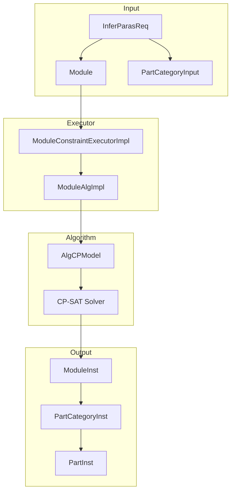

# JMix Config Engine - 核心设计文档

## 1. 概述

JMix Config Engine 是一个基于约束求解的参数推理引擎，专为产品配置场景设计。它利用 Google OR-Tools CP-SAT 求解器，自动计算满足所有业务约束的有效参数组合。

### 1.1 核心能力

| 能力 | 描述 |
|------|------|
| **约束求解** | 基于 CP-SAT 的约束满足问题求解 |
| **参数推理** | 从已知约束反推参数值 |
| **差量加载** | 基于图的依赖追踪实现选择性规则加载 |
| **多实例支持** | 处理动态多实例产品配置 |
| **冲突诊断** | 自动冲突检测与规则隔离 |

### 1.2 目标用户

本引擎面向需要将约束求解能力集成到业务系统中的**后端开发人员**。规则管理和配置界面不在本项目范围内。

---

## 2. 架构概述

### 2.1 整体架构图

```
┌─────────────────────────────────────────────────────────────────────────────┐
│                              架构分层                                         │
├─────────────────────────────────────────────────────────────────────────────┤
│                                                                             │
│  ┌───────────────────────────────────────────────────────────────────────┐  │
│  │                     北向接口层 (North Interface)                       │  │
│  │  ┌─────────────────────┐                                              │  │
│  │  │ ModuleConstraint    │  ← 统一入口，单例模式                         │  │
│  │  │ Executor            │                                              │  │
│  │  └─────────────────────┘                                              │  │
│  └───────────────────────────────────────────────────────────────────────┘  │
│                                    │                                       │
│                                    ▼                                       │
│  ┌───────────────────────────────────────────────────────────────────────┐  │
│  │                     执行器层 (Executor)                                 │  │
│  │  ┌─────────────────────┐  ┌─────────────────────────┐                 │  │
│  │  │ ModuleConstraint    │  │ PartCategoryConstraint  │                 │  │
│  │  │ ExecutorImpl        │  │ ExecutorImpl            │                 │  │
│  │  └─────────────────────┘  └─────────────────────────┘                 │  │
│  └───────────────────────────────────────────────────────────────────────┘  │
│                                    │                                       │
│                                    ▼                                       │
│  ┌───────────────────────────────────────────────────────────────────────┐  │
│  │                     算法模块层 (Algorithm)                               │  │
│  │  ┌─────────────────────┐  ┌─────────────────────────┐                 │  │
│  │  │ ModuleAlgImpl       │  │ PartCategoryAlgImpl     │                 │  │
│  │  │  ├─ SingleInst      │  │  ├─ SingleInst          │                 │  │
│  │  │  └─ MultiInst      │  │  └─ MultiInst          │                 │  │
│  │  └─────────────────────┘  └─────────────────────────┘                 │  │
│  └───────────────────────────────────────────────────────────────────────┘  │
│                                    │                                       │
│                                    ▼                                       │
│  ┌───────────────────────────────────────────────────────────────────────┐  │
│  │                     模型封装层 (Model Wrapper)                          │  │
│  │  ┌─────────────────────────────────────────────────────────────┐     │  │
│  │  │                      AlgCPModel                               │     │  │
│  │  │  (封装 Google OR-Tools CP-SAT，提供简化接口)                  │     │  │
│  │  └─────────────────────────────────────────────────────────────┘     │  │
│  └───────────────────────────────────────────────────────────────────────┘  │
│                                    │                                       │
│                                    ▼                                       │
│  ┌───────────────────────────────────────────────────────────────────────┐  │
│  │                     底层求解器 (Solver)                                │  │
│  │  ┌─────────────────────────────────────────────────────────────┐     │  │
│  │  │                 Google OR-Tools CP-SAT                      │     │  │
│  │  └─────────────────────────────────────────────────────────────┘     │  │
│  └───────────────────────────────────────────────────────────────────────┘  │
│                                                                             │
└─────────────────────────────────────────────────────────────────────────────┘
```

### 2.2 对称设计模式

JMix 的核心设计遵循**对称设计模式**，每个层级都存在对应的组件：

```
┌─────────────────────────────────────────────────────────────────────────────┐
│                           对称设计架构                                        │
├─────────────────────────────────────────────────────────────────────────────┤
│                                                                             │
│    ┌───────────────┐         ┌───────────────┐         ┌───────────────┐  │
│    │   领域模型     │         │   执行器       │         │   算法模块     │  │
│    │  (bmodel)     │         │   (impl)      │         │  (algmodel)   │  │
│    ├───────────────┤         ├───────────────┤         ├───────────────┤  │
│    │               │         │               │         │               │  │
│    │   Module      │    ←→   │   Executor    │    ←→   │   AlgImpl     │  │
│    │               │         │               │         │               │  │
│    ├───────────────┤         ├───────────────┤         ├───────────────┤  │
│    │               │         │               │         │               │  │
│    │ PartCategory │    ←→   │  Executor     │    ←→   │PartCategory   │  │
│    │               │         │               │         │   AlgImpl     │  │
│    │               │         │               │         ├───────────────┤  │
│    │               │         │               │         │ SingleInst    │  │
│    │               │         │               │         │ MultiInst     │  │
│    ├───────────────┤         ├───────────────┤         ├───────────────┤  │
│    │               │         │               │         │               │  │
│    │     Part      │    ←→   │               │         │               │  │
│    │               │         │               │         │               │  │
│    └───────────────┘         └───────────────┘         └───────────────┘  │
│            │                                                                   │
│            │                     结果模型 (cmodel)                               │
│            └──────────────────→  ┌───────────────┐                             │
│                                 │               │                             │
│                                 │  ModuleInst   │                             │
│                                 │               │                             │
│                                 ├───────────────┤                             │
│                                 │               │                             │
│                                 │PartCategoryInst│                            │
│                                 │               │                             │
│                                 ├───────────────┤                             │
│                                 │               │                             │
│                                 │   PartInst    │                             │
│                                 │               │                             │
│                                 ├───────────────┤                             │
│                                 │               │                             │
│                                 │   ParaInst    │                             │
│                                 └───────────────┘                             │
│                                                                             │
└─────────────────────────────────────────────────────────────────────────────┘
```

---

## 3. 核心概念

### 3.1 领域模型层 (Domain Model)

领域模型层定义业务概念的核心数据结构，是整个系统的**静态结构**。

#### 3.1.1 类层次结构

```
Onto (基类)
  │
  ├── ModuleBase (模块/分类基类)
  │     │
  │     ├── Module (模块)
  │     │     │
  │     │     └── PartCategory (部件分类)
  │     │           │
  │     │           └── Part (部件)
  │     │
  │     └── Para (参数)
  │
  └── Rule (规则)
```

#### 3.1.2 Module - 模块

**位置**: `com.jmix.executor.bmodel.Module`

模块是完整约束模型的根容器，包含参数、部件和规则。

| 字段 | 类型 | 描述 |
|------|------|------|
| `id` | Long | 唯一标识符 |
| `version` | String | 版本号（默认 "1.0.0"） |
| `paras` | List\<Para\> | 参数定义列表 |
| `atomicParts` | List\<Part\> | 顶级原子部件 |
| `partCategorys` | List\<PartCategory\> | 部件分类层次 |
| `rules` | List\<Rule\> | 约束规则 |
| `refRelationGraph` | ModuleRefRelationGraph | 依赖关系图 |

```java
Module module = new Module();
module.setId(123L);
module.setCode("TShirtConfig");
module.getParas().add(colorPara);
module.getPartCategorys().add(driveCategory);
module.getRules().add(compatibleRule);
module.init();  // 构建依赖关系图
```

#### 3.1.3 PartCategory - 部件分类

**位置**: `com.jmix.executor.bmodel.PartCategory`

部件分类是部件的容器，支持嵌套和多实例。

| 字段 | 类型 | 描述 |
|------|------|------|
| `code` | String | 分类代码 |
| `partType` | PartType | 部件类型（ATOMIC/CATEGORY） |
| `supportMultiInst` | boolean | 是否支持多实例 |
| `partCategorys` | List\<PartCategory\> | 子分类 |
| `atomicParts` | List\<Part\> | 原子部件 |
| `rules` | List\<Rule\> | 分类级规则 |

```java
// 定义支持多实例的部件分类
@PartAnno(supportMultiInst = true)
@DAttrAnno1(code = "Speed", options = {"Speed_7200:7200", "Speed_5400:5400"})
@DAttrAnno2(code = "Capacity", options = {"Capacity_1T:1", "Capacity_2T:2"})
private PartCategoryVar drive;
```

#### 3.1.4 Part - 部件

**位置**: `com.jmix.executor.bmodel.Part`

部件是配置的基本单元，代表具体的产品组件。

| 字段 | 类型 | 描述 |
|------|------|------|
| `code` | String | 部件代码 |
| `price` | Long | 部件价格 |
| `maxQuantity` | Integer | 最大数量限制 |
| `fatherCode` | String | 父分类代码 |
| `dynAttrs` | DynamicAttribute[] | 动态属性 |

```java
@PartAnno(fatherCode = "drive", attrs = {"7200", "2", "sd"}, price = 80)
private PartVar sd1;  // 2TB 固态硬盘
```

#### 3.1.5 Para - 参数

**位置**: `com.jmix.executor.bmodel.para.Para`

参数是用户可配置的选项，如颜色、尺寸等。

| 字段 | 类型 | 描述 |
|------|------|------|
| `code` | String | 参数代码 |
| `options` | List\<ParaOption\> | 可选值列表 |
| `type` | ParaType | 参数类型 |
| `assignType` | AssignType | 赋值类型 |

### 3.2 执行器层 (Executor)

执行器层负责管理领域模型的生命周期和执行流程。

#### 3.2.1 执行器职责映射

| 领域模型 | 执行器 | 职责 |
|----------|--------|------|
| Module | ModuleConstraintExecutorImpl | 模块生命周期管理、推理编排 |
| PartCategory | PartCategoryConstraintExecutorImpl | 分类级约束执行 |

```java
// 执行器管理模块生命周期
ModuleConstraintExecutorImpl executor = new ModuleConstraintExecutorImpl();
executor.init(config);
executor.addModule(moduleId, module);
Result<List<ModuleInst>> result = executor.inferParas(req);
```

### 3.3 算法模块层 (Algorithm)

算法模块层将领域模型转换为 CP-SAT 约束并执行求解。

#### 3.3.1 算法职责映射

| 领域模型 | 算法模块 | 职责 |
|----------|----------|------|
| Module | ModuleAlgImpl | 模块级变量创建、规则执行 |
| PartCategory | PartCategoryAlgImpl | 分类级变量创建、规则执行 |
| PartCategory (单实例) | SingleInstPartCategoryAlgImpl | 单实例分类处理 |
| PartCategory (多实例) | MultiInstPartCategoryAlgImpl | 多实例分类处理 |

```java
// 算法模块将领域模型转换为约束
ModuleAlgImpl alg = new ModuleAlgImpl();
alg.init(model, module, moduleInput);

// 创建变量
alg.createParaVar(colorPara);   // ParaVar
alg.createPartVar(sd1);        // PartVar

// 执行规则
alg.executeRule(rule);
```

### 3.4 结果模型层 (Result Model)

结果模型层表示求解器的输出，是领域模型的**运行时实例**。

#### 3.4.1 实例-模型对应关系

| 领域模型 | 结果实例 | 描述 |
|----------|----------|------|
| Module | ModuleInst | 模块的一个可行解 |
| PartCategory | PartCategoryInst | 分类实例（带实例ID） |
| Part | PartInst | 部件实例（包含数量和选中状态） |
| Para | ParaInst | 参数实例（包含选中的值） |

```java
// 结果模型是领域模型的实例化
ModuleInst solution = solutions.get(0);
for (PartInst part : solution.getAllParts()) {
    System.out.println(part.getCode() + " qty=" + part.getQuantity());
}
```

### 3.5 变量系统

变量是领域模型在约束求解器中的运行时表示。

#### 3.5.1 变量类型

| 领域模型 | CP变量 | 描述 |
|----------|--------|------|
| Para | ParaVar | 表示参数选中的值 |
| Part | PartVar | 表示部件的数量和选中状态 |

```java
// ParaVar: 参数变量
ParaVar colorVar = model.newIntVar(1, 3, "P1_color");  // 1=Red, 2=Black, 3=White

// PartVar: 部件变量
BoolVar selected = model.newBoolVar("PT1_selected");  // 是否选中
IntVar qty = model.newIntVar(0, 10, "PT1_qty");      // 数量
```

### 3.6 规则表达方式

JMix 支持多种规则表达范式，以适应不同的业务场景。

#### 3.6.1 规则Schema类型体系

```
RuleSchema (抽象基类)
    │
    ├── CompatiableRuleSchema  (结构化-兼容性规则)
    ├── CalculateRuleSchema    (结构化-计算规则)
    ├── SelectRuleSchema      (结构化-选择规则)
    ├── PriorityRuleSchema    (结构化-优先级规则)
    └── CodeRuleSchema        (代码形式-自由表达)
```

#### 3.6.2 各类型规则详解

| Schema类型 | 描述 | 适用场景 |
|------------|------|----------|
| **CompatiableRuleSchema** | 结构化的兼容性规则 | 兼容性约束、不兼容约束、依赖约束 |
| **CalculateRuleSchema** | 结构化的计算规则 | 数值计算、汇总求和 |
| **SelectRuleSchema** | 结构化的选择规则 | 参数选择、部件组合限制 |
| **PriorityRuleSchema** | 结构化的优先级规则 | 成本最小化、性能最大化 |
| **CodeRuleSchema** | 自由代码形式 | 复杂业务逻辑、动态计算 |

### 3.7 依赖关系图

ModuleRefRelationGraph 用于管理规则间的依赖关系，支持差量加载优化。

```
┌──────────────────────────────────────────────────────────┐
│                    依赖关系图                              │
│                                                          │
│   P0 ──────Rule01────────▶ P11 ───Rule11───▶ PT1       │
│   │                           │                          │
│   └──────Rule02──────────────┘                          │
│   │                                                         │
│   └──────Rule02──────────────▶ P21 ───Rule21───▶ PT2   │
│                                                              │
│   节点: P0, P11, P21, PT1, PT2                            │
│   边: Rule01, Rule02, Rule11, Rule21                       │
└──────────────────────────────────────────────────────────┘
```

---

## 4. 组件设计

### 4.1 ModuleConstraintExecutor

**位置**: `com.jmix.executor.ModuleConstraintExecutor`

北向接口，提供统一的约束求解服务。

```java
public interface ModuleConstraintExecutor {
    ModuleConstraintExecutor INST = new ModuleConstraintExecutorImpl();

    Result<Void> init(ConstraintConfig config);
    Result<Void> fini();
    Result<Void> addModule(Long rootModuleId, Module... modules);
    Result<Void> removeModule(Long moduleId);
    Result<List<ModuleInst>> inferParas(InferParasReq req);
    Result<Void> registerExtensible(ExtensibleProcess eProcess);
}
```

### 4.2 ModuleConstraintExecutorImpl

**位置**: `com.jmix.executor.impl.ModuleConstraintExecutorImpl`

核心执行实现，管理模块生命周期和求解工作流。

```java
// 差量加载流程
if (config.getLoadType() == LOAD_TYPE_INCREMENTAL) {
    List<String> inputProgObjs = ReqUtils.buildInputProgObjs(req);
    Pair<List<String>, List<RefProgObjSchema>> subgraph =
        module.querySubGraph(inputProgObjs);
    alg.init(model, module, toModuleInput(module, req));
}
```

### 4.3 AlgCPModel

**位置**: `com.jmix.executor.impl.algmodel.AlgCPModel`

封装 Google OR-Tools CpModel，提供简化的约束定义接口。

```java
// 变量创建
IntVar var = model.newIntVar(0, 10, "quantity");
BoolVar selected = model.newBoolVar("isSelected");

// 约束定义
model.addEquality(expr, value);
model.addLessOrEqual(expr, 100);
model.addImplication(boolA, boolB);
model.addExactlyOne(options);

// 目标函数
model.minimize(costExpr);
model.maximize(scoreExpr);
```

### 4.4 ModuleAlgImpl

**位置**: `com.jmix.executor.impl.algmodel.ModuleAlgImpl`

算法执行实现，处理规则和变量初始化。

```
init()
  │
  ├── initData()          // 初始化变量
  ├── afterInitData()     // 后置处理
  ├── initInput()         // 应用输入约束
  ├── preCalculate()      // PRE 阶段规则
  ├── initRules(MID)      // MID 阶段规则
  └── (postCalculate)     // POST 阶段规则
```

---

## 5. 约束类型

### 5.1 兼容性约束

| 类型 | 逻辑 | 用法 |
|------|------|------|
| **Requires** | `A → B` | 如果 A 被选中，则 B 必须被选中 |
| **Incompatible** | `¬(A ∧ B)` | A 和 B 不能同时被选中 |
| **CoDependent** | `A ↔ B` | A 和 B 必须同时被选中或不选中 |

### 5.2 基数

| 模式 | 描述 | 示例 |
|------|------|------|
| `ONE → ONE` | 单对单 | `Color → Size` |
| `ONE → MANY` | 单对多 | `CPU → [RAM1, RAM2, RAM3]` |
| `MANY → ONE` | 多对单 | `[Opt1, Opt2] → Feature` |

### 5.3 计算约束与优先级约束

```java
// 计算约束
totalPrice = cpu.price + ram.price;

// 优先级约束
PriorityRule: MAX preferenceScore  // 最大化
PriorityRule: MIN totalCost       // 最小化
```

---

## 6. 属性聚合类型 (AttrParaType)

### 6.1 聚合类型详解

| 类型 | 值 | 描述 | 使用场景 |
|------|-----|------|----------|
| **Sum** | 10 | 对每个分类实例的汇总 | 单个实例内的属性求和 |
| **SumSum** | 20 | 对所有实例值汇总 | 跨多实例的总体需求 |
| **Org** | 30 | 原始值 | 直接访问原始属性值 |

### 6.2 Sum vs SumSum

| 场景 | Sum | SumSum |
|------|-----|--------|
| 单实例输入 | 汇总单个实例内选项的属性 | 与 Sum 等效 |
| 多实例输入 | 仅汇总当前实例的属性 | 汇总所有实例的属性 |

---

## 7. 执行模型

### 7.1 求解流程

```
inferParas(InferParasReq)
        │
        ▼
┌───────────────────┐
│ 1. 验证请求       │
└───────────────────┘
        │
        ▼
┌───────────────────┐
│ 2. 获取模块       │
└───────────────────┘
        │
        ▼
┌───────────────────┐
│ 3. 创建约束模型   │
│    (差量/全量)    │
└───────────────────┘
        │
        ▼
┌───────────────────┐
│ 4. 初始化变量和规则│
└───────────────────┘
        │
        ▼
┌───────────────────┐
│ 5. CP-SAT 求解    │
└───────────────────┘
        │
        ▼
┌───────────────────┐
│ 6. 后处理         │
└───────────────────┘
        │
        ▼
┌───────────────────┐
│ 7. 返回结果       │
└───────────────────┘
```

### 7.2 冲突检测

当 `config.isDebugByRelaxVar()` 启用时：

```java
// 步骤1: 为每个规则附加松弛变量
// 步骤2: 最小化违反的规则
// 步骤3: 识别冲突规则
// 步骤4: 报告冲突
```

---

## 8. API 参考

### 8.1 使用示例

```java
// 1. 初始化
ModuleConstraintExecutor.INST.init(config);

// 2. 添加模块
ModuleConstraintExecutor.INST.addModule(moduleId, module);

// 3. 执行推理
InferParasReq req = new InferParasReq();
req.setModuleId(123L);
req.setEnumerateAllSolution(true);
Result<List<ModuleInst>> result = ModuleConstraintExecutor.INST.inferParas(req);

// 4. 处理结果
if (result.getCode() == Result.SUCCESS) {
    for (ModuleInst solution : result.getData()) {
        System.out.println(solution.toShortString(true));
    }
}
```

---

## 9. 典型应用场景

### 9.1 多实例部件配置

```java
@ModuleAnno(id = 123L)
public class DynMultReqMultiInstConstraint extends ConstraintAlgImplTestBase {

    @PartAnno(supportMultiInst = true)
    @DAttrAnno1(code = "Speed", options = {"Speed_7200:7200", "Speed_5400:5400"})
    @DAttrAnno2(code = "Capacity", options = {"Capacity_1T:1", "Capacity_2T:2"})
    private PartCategoryVar drive;

    @PartAnno(fatherCode = "drive", attrs = {"7200", "2", "sd"}, price = 80)
    private PartVar sd1;

    @CodeRuleAnno(normalNaturalCode = "4核CPU不兼容固态硬盘")
    private void logicAB1() {
        inCompatible("logicAB1", "cpu:CoreNum=4", "drive:Type=sd");
    }

    @PriorityRuleAnno(strategy = PriorityStrategy.MIN, effectScope = EffectScope.AllInst)
    private void logicB2() {
        PartAlgCPLinearExpr totalCapacity = sum4Quantity("Capacity", "");
        if (drive.getSumSumParaByAttr("Capacity").getIsHasInputed()) {
            int requiredCapacity = drive.getSumSumParaByAttr("Capacity").getInputValue();
            model.addGreaterOrEqual(totalCapacity, requiredCapacity);
        }
    }
}
```

---

## 10. 数据流图



---

## 11. 术语表

| 术语 | 定义 |
|------|------|
| **bmodel** | 领域模型层，定义业务概念 |
| **cmodel** | 结果模型层，表示运行时实例 |
| **algmodel** | 算法模型层，执行约束求解 |
| **Module** | 模块，约束模型的根容器 |
| **PartCategory** | 部件分类，支持嵌套和多实例 |
| **Part** | 部件，配置的基本单元 |
| **Para** | 参数，用户可配置的选项 |
| **ParaVar** | 参数变量，CP模型中的参数 |
| **PartVar** | 部件变量，CP模型中的部件 |
| **ModuleInst** | 模块实例，一个可行解 |
| **RuleSchema** | 规则表达范式 |
| **AttrParaType** | 属性聚合类型 |

---

## 12. 修订历史

| 版本 | 日期 | 变更内容 |
|------|------|----------|
| 1.0.0 | 2026-04-23 | 初始版本 |
| 1.0.1 | 2026-04-23 | 新增规则表达方式、AttrParaType详解 |
| 1.0.2 | 2026-04-23 | 重写核心概念章节，突出对称设计模式 |
