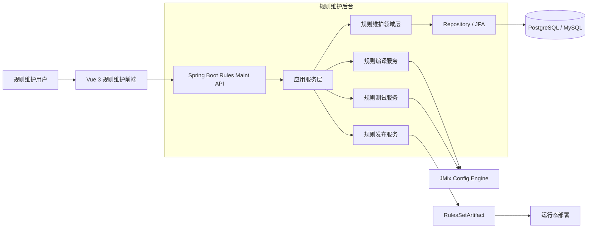

# RFC-0010: 规则管理维护功能总体架构与低保真原型

> 状态：草案（Draft）
> 日期：2026-05-20
> 位置：`rulesmaint/`
> 参考文档：`doc/RFC-0008-Rule-Model-IR-Refactor.md`, `doc/RFC-0007-Struct-Combination-Rule-Schema.md`, `doc/CORE-DESIGN.md`, `doc/ACCEPTANCE.md`

---

## 设计决策摘要

| 主题 | 决策 |
| --- | --- |
| 总体架构 | 前后端分离，后台使用 Java + Spring Boot，前端使用 Vue 3 + TypeScript + Vite |
| 规则核心模型 | 继承 RFC-0008 的 `RuleRepr[] + RuleSemantic + RuleExecution[] + RuleReferenceSet` 分层 |
| 语义源头 | 以 `RuleSemantic` 作为规则可执行语义的权威版本，结构化表单、自然语言和 DSL 都是表现或编辑入口 |
| 编辑器重点 | 规则编写页面采用三栏协同：领域上下文、规则编辑、DSL/测试/执行反馈 |
| 结构化编辑 | 表单和表格生成结构化 `RuleRepr`，编译为 Java-like DSL，再生成引用关系和测试用例 |
| 自然语言编辑 | 自然语言先生成候选 DSL，必须经解析和人工确认后才能成为 `RuleSemantic` |
| DSL 反向同步 | 直接修改 DSL 后重新解析，生成中文描述、结构化摘要和测试用例草案 |
| 测试闭环 | 规则保存前必须完成测试生成、样例执行、预期结果确认和版本记录 |
| 引擎边界 | 生成的执行形式遵守现有南向边界，使用 `ModuleAlgBase` / `ModuleCPModel` / `AlgCP*` facade，不暴露 OR-Tools 实现类型 |
| 原型位置 | 低保真原型位于 `rulesmaint/prototype.html`，模拟数据位于 `rulesmaint/mock-business-data.json` |

---

## 1. 摘要

规则管理维护功能面向业务配置人员、规则工程师和开发人员，目标是把规则从“只能写代码”提升为“可结构化维护、可自然语言起草、可 DSL 校验、可测试闭环、可追踪发布”的产品化能力。

本设计不替代现有 JMix Config Engine，而是在其上方新增维护态应用。维护态负责领域对象管理、规则 CRUD、编辑器体验、规则编译、测试生成、版本审计和发布编排；运行态仍由当前约束求解引擎承担。维护态与运行态之间通过 RFC-0008 的规则 IR 分层隔离。

---

## 2. 动机

当前规则模型已经有 `Rule.rawCode`、`RuleSchema`、`CalcStage` 和 `RefProgObjSchema` 等基础，但业务用户需要更完整的维护体验：

1. 可以通过结构化表单维护组合、兼容、计算、优先级和后置计算规则。
2. 可以输入自然语言，例如“当客户编码为 HAIER 且订单金额超过 10 万时，合同折扣不得超过 8%”。
3. 系统能自动生成中间 DSL、引用关系、执行形式和测试用例。
4. 规则工程师可以直接修改 DSL，并让中文描述和结构化摘要同步更新。
5. 每次规则变更都能执行测试，保存版本，并明确影响哪些领域对象和规则包。

---

## 3. 技术架构

### 3.1 总体分层



### 3.2 后台模块

| 模块 | 职责 |
| --- | --- |
| `rules-maint-api` | REST API、鉴权、请求校验、OpenAPI 文档 |
| `rules-maint-domain` | `Rule`、`RuleRepr`、`RuleSemantic`、`RuleExecution`、`RuleReferenceSet`、`DomainObject` 等领域模型 |
| `rules-maint-compiler` | 结构化表单、自然语言、DSL 之间的解析、生成、校验和引用抽取 |
| `rules-maint-test` | 自动生成测试用例、执行样例推理、保存运行结果 |
| `rules-maint-publish` | 规则包构建、版本冻结、发布审批、回滚 |
| `rules-maint-integration` | 对接当前 `ModuleConstraintExecutor`、`ModuleAlgBase` 和规则构建链路 |

### 3.3 后台 API 草案

| API | 方法 | 说明 |
| --- | --- | --- |
| `/api/domain-objects` | `GET` | 查询领域对象、字段、SDK 和可选值 |
| `/api/rules` | `GET/POST` | 规则列表和创建 |
| `/api/rules/{code}` | `GET/PUT/DELETE` | 规则详情、更新和删除 |
| `/api/rules/{code}/compile` | `POST` | 将结构化表单、自然语言或 DSL 编译为 `RuleSemantic` |
| `/api/rules/{code}/sync-repr` | `POST` | 根据 DSL 反向生成中文描述和结构化摘要 |
| `/api/rules/{code}/references` | `GET` | 查看 `RuleReferenceSet` 和影响范围 |
| `/api/rules/{code}/test-cases/generate` | `POST` | 自动生成测试用例 |
| `/api/rules/{code}/test-runs` | `POST` | 执行测试并返回运行结果 |
| `/api/artifacts` | `POST` | 构建 `RulesSetArtifact` |

### 3.4 核心数据表

| 表 | 关键字段 |
| --- | --- |
| `rule_definition` | `code`, `name`, `owner_code`, `rule_kind`, `calc_stage`, `status`, `current_version` |
| `rule_repr` | `rule_code`, `type`, `content`, `is_authoritative`, `revision` |
| `rule_semantic` | `rule_code`, `type`, `content`, `parser_version`, `checksum` |
| `rule_execution` | `rule_code`, `type`, `calc_stage`, `content`, `capability_status` |
| `rule_reference` | `rule_code`, `prog_obj_type`, `prog_obj_code`, `prog_obj_field`, `direction` |
| `rule_test_case` | `rule_code`, `input_json`, `expected_json`, `generated_by`, `confirmed` |
| `rule_test_run` | `test_case_id`, `status`, `actual_json`, `engine_trace_id`, `started_at`, `finished_at` |
| `rule_version` | `rule_code`, `version`, `change_summary`, `created_by`, `created_at` |

---

## 4. 规则模型映射

维护端不直接把自然语言、表格和执行代码混在一个字段里，而是按 RFC-0008 分层：

```text
Rule
  code
  name
  ownerCode
  ruleKind: ATOMIC | COMPOSITE
  calcStage: PRE | MID | POST
  reprs: RuleRepr[]
  semantic: RuleSemantic
  executions: RuleExecution[]
  references: RuleReferenceSet
```

结构化规则编辑生成 `RuleRepr(type=STRUCT_DSL)`，自然语言输入生成 `RuleRepr(type=NATURAL_LANGUAGE)`，DSL 编辑器内容生成或更新 `RuleSemantic(type=STRUCT_DSL)`。只有 `RuleSemantic` 解析通过后，才允许生成 `RuleExecution`。

---

## 5. 规则编写页面设计

### 5.1 页面布局

规则编写页是本功能重点，建议采用三栏协同布局：

| 区域 | 内容 |
| --- | --- |
| 左栏 | 领域对象树、字段搜索、规则列表、影响范围 |
| 中栏 | 结构化编辑器或自然语言编辑器 |
| 右栏 | DSL、引用关系、测试用例、运行结果和版本差异 |

顶部提供规则基本信息：规则编码、名称、归属对象、规则类型、执行阶段、状态、版本。

### 5.2 场景一：结构化规则编辑

以 CPU 与硬盘白名单为例：

```text
4 核 CPU 只能配 5400 转硬盘
8 核 CPU 可配 5400 或 7200 转硬盘
12 核 CPU 必须配 7200 转硬盘
```

结构化表单维护：

| 条件对象 | 字段 | 操作符 | 值 | 关系 | 结果对象 | 字段 | 操作符 | 值 |
| --- | --- | --- | --- | --- | --- | --- | --- | --- |
| `cpu` | `CoreNum` | `=` | `4` | `CO_DEPENDENT` | `drive` | `Speed` | `=` | `5400` |
| `cpu` | `CoreNum` | `=` | `8` | `CO_DEPENDENT` | `drive` | `Speed` | `IN` | `5400,7200` |
| `cpu` | `CoreNum` | `>=` | `12` | `CO_DEPENDENT` | `drive` | `Speed` | `=` | `7200` |

生成 DSL：

```java
rule cpu_drive_combo_white {
  owner Server;
  stage MID;
  type WHITE_LIST;

  allow when cpu.CoreNum == 4 and drive.Speed == 5400;
  allow when cpu.CoreNum == 8 and drive.Speed in [5400, 7200];
  allow when cpu.CoreNum >= 12 and drive.Speed == 7200;
}
```

自动测试用例：

| 用例 | 输入 | 预期 |
| --- | --- | --- |
| `TC-001` | `cpu.CoreNum=4, drive.Speed=5400` | `PASS` |
| `TC-002` | `cpu.CoreNum=4, drive.Speed=7200` | `FAIL` |
| `TC-003` | `cpu.CoreNum=8, drive.Speed=7200` | `PASS` |
| `TC-004` | `cpu.CoreNum=12, drive.Speed=5400` | `FAIL` |

### 5.3 场景二：自然语言规则编辑

输入：

```text
当客户编码为 HAIER 且订单金额大于等于 100000 时，合同折扣率不得超过 8%。
```

系统结合上下文识别：

| 识别项 | 结果 |
| --- | --- |
| 归属对象 | `Contract` |
| 引用对象 | `Contract.Customer_Code`, `Order.Amount`, `Contract.Discount` |
| 执行阶段 | `PRE` |
| 规则类型 | `ATOMIC` |

生成 DSL：

```java
rule contract_discount_guard {
  owner Contract;
  stage PRE;

  if Contract.Customer_Code == "HAIER"
     and Order.Amount >= 100000
  then Contract.Discount <= 0.08;
}
```

DSL 反向同步中文：

```text
当客户编码等于 HAIER 且订单金额大于等于 100000 时，合同折扣率必须小于等于 8%。
```

自动测试用例：

| 用例 | 输入 | 预期 |
| --- | --- | --- |
| `TC-101` | `HAIER, Amount=120000, Discount=0.10` | `FAIL` |
| `TC-102` | `HAIER, Amount=120000, Discount=0.05` | `PASS` |
| `TC-103` | `OTHER, Amount=120000, Discount=0.10` | `PASS` |
| `TC-104` | `HAIER, Amount=99999, Discount=0.10` | `PASS` |

### 5.4 联动策略

| 操作 | 系统行为 |
| --- | --- |
| 修改结构化表单 | 生成新的 `STRUCT_DSL` 表现，重新编译 `RuleSemantic`，刷新 DSL、引用和测试 |
| 修改自然语言 | 保留自然语言 `RuleRepr`，生成候选 DSL，等待用户确认 |
| 修改 DSL | 重新解析 DSL，反向生成中文描述和结构化摘要 |
| DSL 解析失败 | 不覆盖已有 `RuleSemantic`，显示解析错误和最近可用版本 |
| 测试用例修改 | 标记为用户确认版本，参与保存前校验 |

同步规则建议采用“显式权威源”：

1. 用户正在编辑的入口是当前权威输入。
2. 编译成功后，`RuleSemantic` 成为可执行语义权威。
3. 其他表现形式由 `RuleSemantic` 派生，但保留用户原始输入以便审计。

---

## 6. 测试闭环

测试生成器输入：

1. `RuleSemantic.content`
2. `RuleReferenceSet`
3. 领域对象字段类型、枚举值和部件样本
4. 历史测试用例

生成策略：

| 类型 | 生成方式 |
| --- | --- |
| 正向样例 | 构造命中规则且满足约束的输入 |
| 反向样例 | 构造命中规则但违反结果的输入 |
| 边界样例 | 数值阈值的等于、小于、大于 |
| 不相关样例 | 条件不命中时应通过 |
| 回归样例 | 复用上个版本确认过的测试用例 |

执行策略：

1. PRE 规则：运行输入转换和参数补全。
2. MID 规则：调用求解器获得可行解或无解。
3. POST 规则：对每个 `ModuleInst` 写入派生参数。
4. 结果写入 `rule_test_run`，并关联规则版本。

---

## 7. 前端技术选型

| 能力 | 建议 |
| --- | --- |
| 应用框架 | Vue 3 + TypeScript |
| 构建工具 | Vite |
| 路由 | Vue Router |
| 状态管理 | Pinia |
| UI 组件 | Element Plus，适合后台管理和表单密集界面 |
| DSL 编辑器 | Monaco Editor |
| 依赖图/流程图 | Vue Flow 或 Cytoscape.js |
| 图表 | Apache ECharts |
| 数据请求 | TanStack Query for Vue 或 Axios + Pinia service |
| 测试 | Vitest + Vue Test Utils + Playwright |

UI 风格建议：深色工作台、细线网格、青色/绿色状态色、琥珀色警告、洋红色差异提示。规则维护是高密度工作台，不建议做营销式首页。

---

## 8. 验收准则

### AC-001: 结构化编辑生成 DSL

```java
@Test
public void testStructuredEditor_GeneratesSemanticDsl() {
    RuleDraft draft = structuredDraft()
            .owner("Server")
            .stage("MID")
            .whiteList("cpu.CoreNum", "=", "4", "drive.Speed", "=", "5400")
            .build();

    CompileResult result = compiler.compileStructured(draft);

    assertTrue(result.isSuccess());
    assertTrue(result.getSemanticDsl().contains("rule cpu_drive_combo_white"));
    assertTrue(result.getReferences().contains("cpu", "CoreNum"));
    assertTrue(result.getReferences().contains("drive", "Speed"));
}
```

### AC-002: 自然语言生成候选 DSL

```java
@Test
public void testNaturalLanguage_GeneratesCandidateDsl() {
    String input = "当客户编码为 HAIER 且订单金额大于等于 100000 时，合同折扣率不得超过 8%。";

    CompileResult result = compiler.compileNaturalLanguage(input, domainContext("Contract", "Order"));

    assertTrue(result.isSuccess());
    assertEquals("Contract", result.getOwnerCode());
    assertTrue(result.getSemanticDsl().contains("Contract.Discount <= 0.08"));
}
```

### AC-003: DSL 修改后同步中文描述

```java
@Test
public void testDslEdit_SyncsNaturalLanguageDescription() {
    String dsl = """
            rule contract_discount_guard {
              owner Contract;
              stage PRE;
              if Contract.Customer_Code == "HAIER" and Order.Amount >= 100000
              then Contract.Discount <= 0.05;
            }
            """;

    SyncResult result = compiler.syncReprFromDsl(dsl);

    assertTrue(result.isSuccess());
    assertTrue(result.getNaturalLanguage().contains("折扣率必须小于等于 5%"));
}
```

### AC-004: 自动生成测试并执行

```java
@Test
public void testRuleTest_GenerateAndRun() {
    Rule rule = ruleRepository.findByCode("contract_discount_guard");

    List<RuleTestCase> cases = testGenerator.generate(rule);
    RuleTestRun run = testRunner.run(rule, cases);

    assertTrue(cases.size() >= 4);
    assertEquals(RuleTestRunStatus.PASSED, run.getStatus());
}
```

### AC-005: 保存前阻断未确认测试

```java
@Test
public void testSaveRule_BlocksUnconfirmedGeneratedTests() {
    RuleDraft draft = draftWithGeneratedButUnconfirmedTests();

    SaveResult result = ruleService.save(draft);

    assertFalse(result.isSuccess());
    assertTrue(result.getMessage().contains("unconfirmed test cases"));
}
```

---

## 9. 实现计划

| 阶段 | 任务 | 优先级 |
| --- | --- | --- |
| 1 | 建立规则维护后台骨架：Spring Boot、规则 CRUD、领域对象查询 | P0 |
| 2 | 建立 Vue 3 前端骨架：路由、布局、规则列表、详情页 | P0 |
| 3 | 实现结构化规则编辑器和 DSL 生成 | P0 |
| 4 | 实现 DSL 解析、引用抽取和错误定位 | P0 |
| 5 | 实现测试用例生成和测试运行 API | P0 |
| 6 | 实现自然语言到 DSL 的候选生成和人工确认流 | P1 |
| 7 | 实现 DSL 反向生成中文描述和结构化摘要 | P1 |
| 8 | 实现规则版本、审批、发布和回滚 | P1 |
| 9 | 实现影响分析、覆盖率和差异对比 | P2 |

---

## 10. 风险与约束

| 风险 | 策略 |
| --- | --- |
| 自然语言歧义 | 自然语言只生成候选 DSL，必须经过解析和确认 |
| 多表现形式冲突 | 以 `RuleSemantic` 为可执行权威，所有表现形式记录 revision |
| DSL 能力过大 | 使用白名单语法和受控函数，不允许任意脚本执行 |
| 执行后端差异 | `RuleExecution` 声明执行形式，编译期做能力校验 |
| 测试误判 | 生成测试必须允许用户修改预期，确认后才能作为回归样例 |
| 规则包发布风险 | 发布前执行受影响规则集的回归测试，支持版本回滚 |

---

## 11. 待确认问题

Q1. 自然语言到 DSL 的能力首期是否允许接入外部大模型，还是先做模板/规则解析器？

Q2. 规则维护系统的持久化数据库是否沿用项目现有数据库选型，还是允许独立 PostgreSQL/MySQL？

Q3. 规则测试运行需要真实调用当前求解引擎，还是首期允许用 mock runner 展示闭环？

Q4. 规则审批发布是否需要接入现有账号、角色和组织权限体系？

---

## 12. 参考资料

- `doc/RFC-0008-Rule-Model-IR-Refactor.md`
- `doc/RFC-0007-Struct-Combination-Rule-Schema.md`
- `doc/CORE-DESIGN.md`
- `doc/ACCEPTANCE.md`
- Vue 官方文档：https://vuejs.org/guide/introduction.html
- Vue Router 官方文档：https://router.vuejs.org/
- Pinia 官方文档：https://pinia.vuejs.org/
- Element Plus 官方文档：https://element-plus.org/
- Monaco Editor 官方站点：https://microsoft.github.io/monaco-editor/
- Apache ECharts 官方文档：https://echarts.apache.org/

